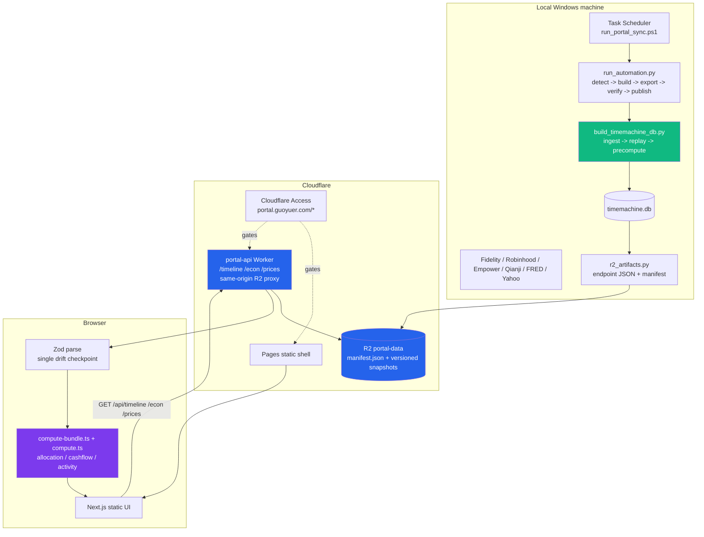
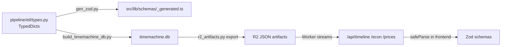

# Portal

Personal finance dashboard for Fidelity, Robinhood, Empower 401k, Qianji cashflow, and FRED/Yahoo market context.

**Live:** https://portal.guoyuer.com (protected by Cloudflare Access)

## Architecture



The frontend is a static Next.js shell on Cloudflare Pages. The Worker is mounted at `portal.guoyuer.com/api/*` and streams precomputed JSON artifacts from R2, so API calls share the same Cloudflare Access session as the page and need no CORS handshake.

Data publication is manifest-last: the pipeline exports endpoint-shaped JSON from local SQLite, verifies hashes, row counts, latest-date coverage, and frontend Zod schemas, uploads versioned snapshot objects to R2, readback-checks them, then flips `manifest.json`.

## Runtime API

- `GET /api/timeline` - full finance bundle, parsed once by `use-timeline-data.ts`
- `GET /api/econ` - FRED/Yahoo macro snapshot and series
- `GET /api/prices` - all ticker price/transaction payloads, loaded lazily by ticker/group charts

The Worker does not query SQL and does not run runtime Zod validation. It owns same-origin routing, manifest lookup, R2 object streaming with `no-store` headers, and explicit 5xx failures for missing/invalid artifacts.

## Commands

```bash
# Frontend
npm run dev
npm run build
npm run test
npx playwright test

# Worker
cd worker && npx wrangler dev --local
cd worker && npx wrangler deploy

# Python pipeline
cd pipeline && .venv/Scripts/python.exe -m pytest -q -n 4
cd pipeline && .venv/Scripts/python.exe -m mypy etl/ --strict --ignore-missing-imports
cd pipeline && .venv/Scripts/python.exe -m ruff check .

# Build local SQLite
cd pipeline && .venv/Scripts/python.exe scripts/build_timemachine_db.py

# Export, verify, and publish R2 artifacts
cd pipeline && .venv/Scripts/python.exe scripts/r2_artifacts.py export
cd pipeline && .venv/Scripts/python.exe scripts/r2_artifacts.py verify
cd pipeline && .venv/Scripts/python.exe scripts/r2_artifacts.py publish --remote

# Automated pipeline
cd pipeline && .venv/Scripts/python.exe scripts/run_automation.py
cd pipeline && .venv/Scripts/python.exe scripts/run_automation.py --dry-run

# Local Worker against already-published local R2 artifacts
cd worker && npx wrangler dev --local
```

## Local Development

1. Install Node and Python dependencies:

```bash
npm install
cd pipeline && python -m venv .venv
cd pipeline && .venv/Scripts/python.exe -m pip install -r requirements.txt
cd pipeline && .venv/Scripts/python.exe -m pip install pytest pytest-cov pytest-xdist mypy ruff hypothesis
cd worker && npm install
```

2. Configure frontend API base URL:

```bash
cat > .env.local <<EOF
NEXT_PUBLIC_TIMELINE_URL=http://localhost:8787
EOF
```

3. Publish local artifacts and run both servers:

```bash
cd pipeline
.venv/Scripts/python.exe scripts/build_timemachine_db.py
.venv/Scripts/python.exe scripts/r2_artifacts.py export
.venv/Scripts/python.exe scripts/r2_artifacts.py publish --local
cd ..

# Terminal 1
cd worker && npx wrangler dev --local

# Terminal 2
npm run dev
```

`publish --local` runs artifact verification before writing to Wrangler's local
R2 state.

## Type Contract



- Python `etl/types.py` is the source for generated Zod schemas.
- SQLite `timemachine.db` remains the local SQL/debug surface.
- R2 artifacts are endpoint-shaped JSON, not a dump of the DB file.
- Frontend Zod parsing is the single runtime drift checkpoint.

## Project Structure

```text
portal/
├── src/                         # Next.js frontend
│   ├── app/                     # finance + econ routes
│   ├── components/              # dashboard UI and charts
│   └── lib/                     # compute, hooks, schemas, formatting
├── worker/                      # R2-backed Cloudflare Worker
│   ├── src/index.ts             # /timeline /econ /prices
│   ├── src/utils.ts             # error helpers
│   └── wrangler.toml            # R2 binding PORTAL_DATA -> portal-data
├── pipeline/
│   ├── etl/                     # ingest, replay, precompute, validate
│   ├── scripts/
│   │   ├── build_timemachine_db.py
│   │   ├── r2_artifacts.py      # export / verify / publish
│   │   ├── run_automation.py
│   ├── tests/
│   └── tools/gen_zod.py
├── e2e/                         # Playwright tests
├── docs/                        # current docs + archive index
└── .github/workflows/           # CI and Pages deploy
```

## Setup

1. Cloudflare: create R2 bucket `portal-data`.
2. Worker: configure `worker/wrangler.toml` binding `PORTAL_DATA` to `portal-data`, then deploy `portal-api`.
3. Pages: set `NEXT_PUBLIC_TIMELINE_URL=https://portal.guoyuer.com/api`.
4. Access: protect `portal.guoyuer.com/*` with the Google allow-list.
5. Pipeline: copy `pipeline/config.example.json` to `pipeline/config.json`, add every held ticker/account mapping, and configure `pipeline/.env` for optional SMTP/FRED settings.
6. First publish: build SQLite, export/verify artifacts, publish to remote R2, then deploy the Worker.

## Notes

- `NEXT_PUBLIC_TIMELINE_URL` is a base URL; endpoint suffixes are added in `src/lib/config.ts`.
- In Git Bash/MSYS, prefix builds with `MSYS_NO_PATHCONV=1` when `NEXT_PUBLIC_TIMELINE_URL` starts with `/` or another path-like value.
- React Compiler is enabled. Do not add manual `useMemo` / `useCallback`; move expensive transforms upstream into `src/lib/compute/` or `src/lib/format/`.

## License

[MIT](LICENSE)
