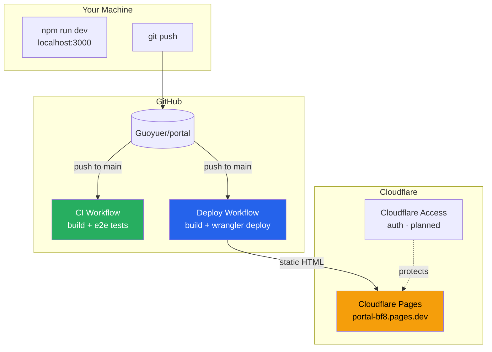
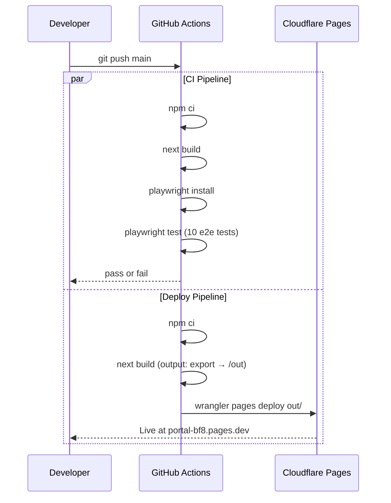
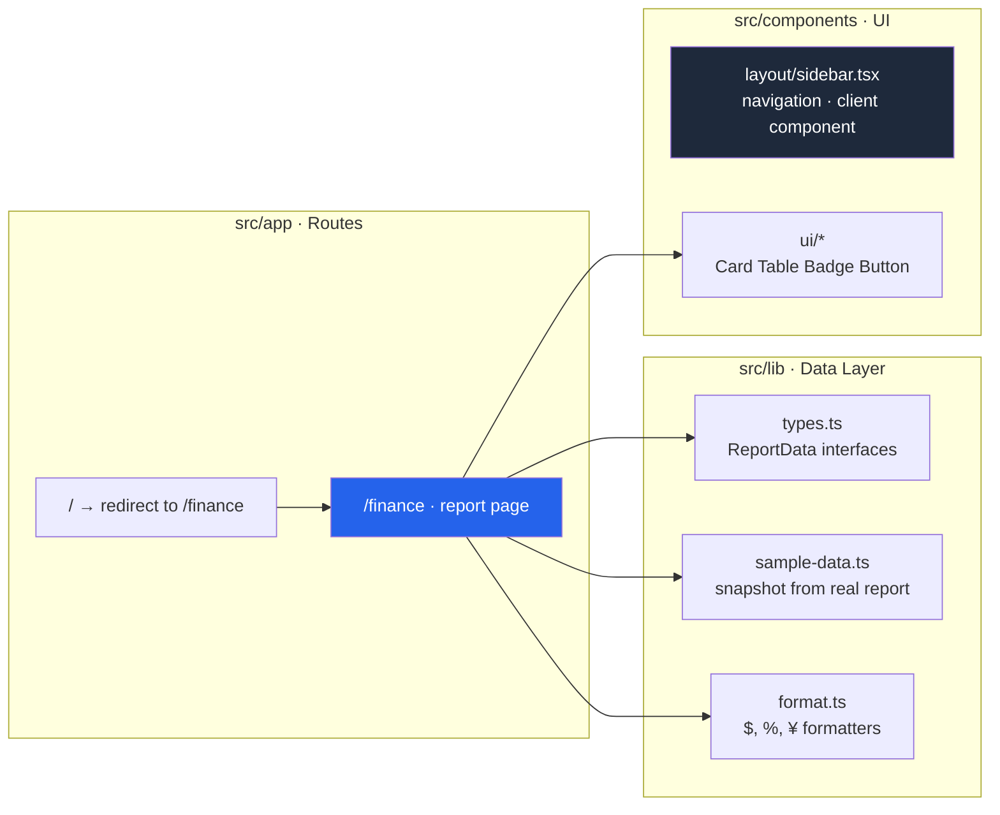
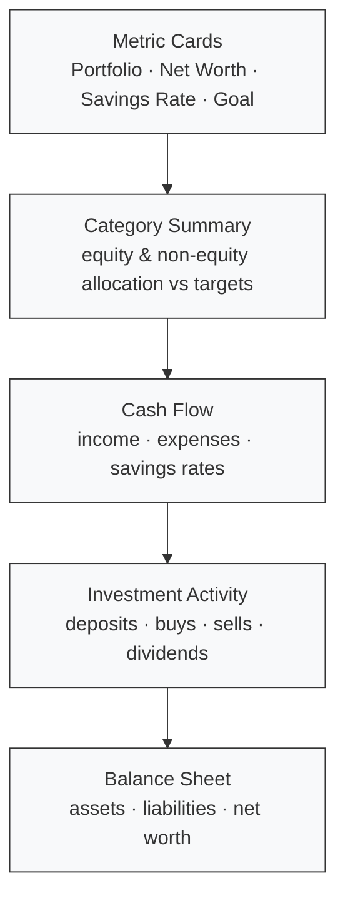
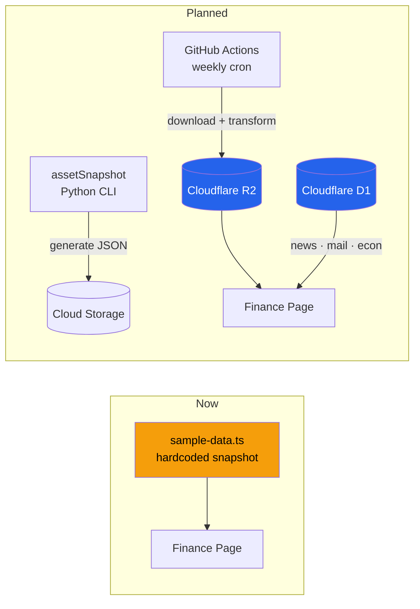

# Portal

Personal one-stop dashboard — finance reports, email triage, news, and economic analysis. Currently serves the financial report from [assetSnapshot](https://github.com/Guoyuer/assetSnapshot); more modules planned.

**Live:** https://portal-bf8.pages.dev

## Architecture



## How Deployment Works

Every push to `main` triggers two parallel GitHub Actions workflows:



Key detail: `next.config.ts` sets `output: "export"`, which makes Next.js produce **pure static HTML/CSS/JS** in the `out/` directory. No server needed — Cloudflare Pages serves the files directly from its edge CDN.

## Project Structure



```
portal/
├── src/
│   ├── app/
│   │   ├── layout.tsx              # Root layout + sidebar
│   │   ├── page.tsx                # / → redirects to /finance
│   │   ├── globals.css             # Tailwind + shadcn theme
│   │   └── finance/
│   │       └── page.tsx            # Finance report (Server Component)
│   ├── components/
│   │   ├── layout/
│   │   │   └── sidebar.tsx         # Nav sidebar (Client Component)
│   │   └── ui/                     # shadcn/ui primitives
│   │       ├── card.tsx
│   │       ├── table.tsx
│   │       ├── badge.tsx
│   │       ├── button.tsx
│   │       └── separator.tsx
│   └── lib/
│       ├── types.ts                # TypeScript interfaces (mirrors assetSnapshot's ReportData)
│       ├── sample-data.ts          # Real report data snapshot for dev/testing
│       └── format.ts               # fmtCurrency, fmtPct, fmtYuan
├── e2e/
│   └── finance.spec.ts             # 10 Playwright e2e tests
├── .github/workflows/
│   ├── ci.yml                      # Build + e2e on push/PR
│   └── deploy.yml                  # Build + deploy to Cloudflare Pages
├── next.config.ts                  # Static export mode
├── playwright.config.ts
└── package.json
```

## Report Sections

The finance page renders data matching the [assetSnapshot](https://github.com/Guoyuer/assetSnapshot) HTML report:



Collapsible rows (native `<details>`) for:
- **Expenses** below $200 threshold → "... and N more" expandable
- **Activity tickers** beyond top 5 → expandable overflow

## Data Flow (Current vs Planned)



## Tech Stack

| Layer | Choice | Why |
|-------|--------|-----|
| Framework | Next.js 15 (App Router) | Marketable, React ecosystem, file-based routing |
| Styling | Tailwind CSS v4 + shadcn/ui | Utility-first, copy-paste components (not npm dep) |
| Fonts | Geist Sans + Geist Mono | Clean, designed for dashboards |
| Hosting | Cloudflare Pages | Edge CDN, free tier, no cold starts |
| Auth (planned) | Cloudflare Access | Zero-trust, Google login, no code |
| Database (planned) | Cloudflare D1 (SQLite) | No pausing, portable, generous free tier |
| Storage (planned) | Cloudflare R2 (S3-compatible) | Reports, data blobs |
| CI | GitHub Actions | Build + Playwright e2e tests |
| E2E Tests | Playwright | Chromium, 10 tests, runs in CI |

## Adding a New Module

Each module follows the same pattern:

```
src/app/{module}/page.tsx        ← route + UI
src/lib/{module}-types.ts        ← data interfaces
src/lib/{module}-data.ts         ← data fetching
e2e/{module}.spec.ts             ← tests
```

Planned modules: **Mail** (Gmail API + AI triage), **News** (RSS aggregation), **Economy** (FRED/Yahoo indicators).

## Development

```bash
npm install
npm run dev          # http://localhost:3000

# Run e2e tests (builds first)
npx next build
npx playwright test

# Preview production build locally
npx serve out -l 3000
```

## Secrets

| Secret | Where | Purpose |
|--------|-------|---------|
| `CLOUDFLARE_ACCOUNT_ID` | GitHub repo secrets | Cloudflare account identifier |
| `CLOUDFLARE_API_TOKEN` | GitHub repo secrets | Wrangler deploy permission |
