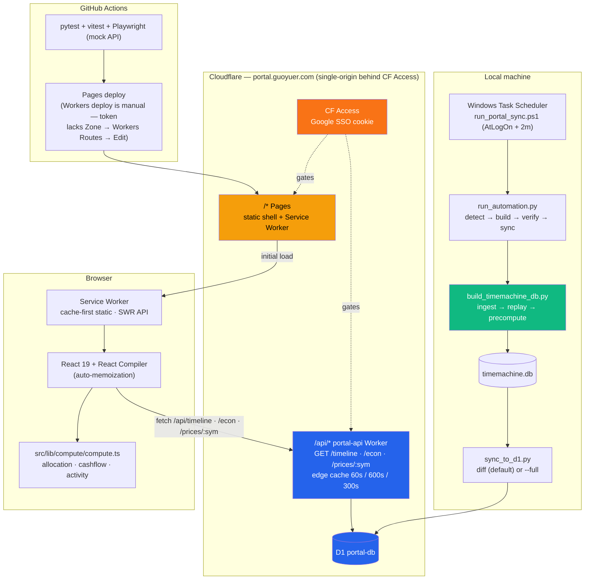
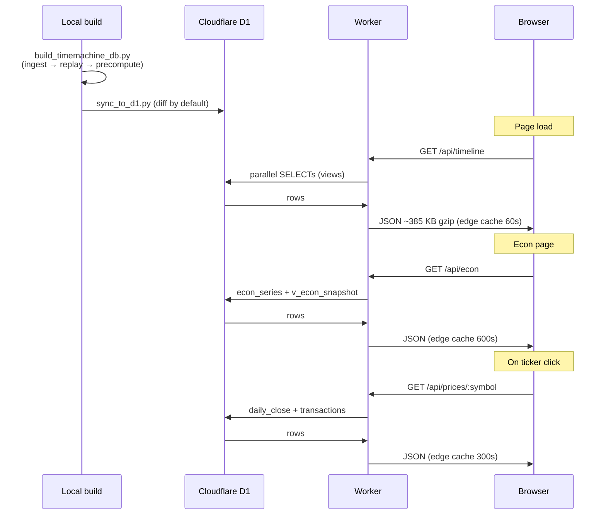
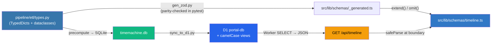

# Portal

Personal one-stop dashboard. Finance reports with live data from Fidelity brokerage + [Qianji](https://qianjiapp.com/) expense tracking + Empower 401k, plus an economic indicators dashboard (FRED). More modules planned.

**Live:** https://portal.guoyuer.com (protected by Cloudflare Access)

## Architecture



**Key design:** Portal is a static shell deployed to Cloudflare Pages. A Worker is mounted as a zone route on the same origin (`portal.guoyuer.com/api/*` → `portal-api`) so every `/api/*` call shares the same CF Access session cookie — no CORS, no cross-subdomain handshake. The frontend fetches once on load via `GET /api/timeline`, then computes allocation, cashflow, activity, and reconciliation locally in `src/lib/compute/compute.ts` via `src/lib/hooks/use-bundle.ts`. Brush drag is zero-latency (no network round-trips). Ticker dialogs fetch `GET /api/prices/:symbol` on demand.


## Data Pipeline



## Project Structure

```
portal/
├── src/                               # Next.js frontend (TypeScript)
│   ├── app/
│   │   ├── layout.tsx                 # Root layout + sidebar
│   │   ├── page.tsx                   # / → redirects to /finance
│   │   ├── finance/
│   │   │   └── page.tsx               # Finance dashboard (client component)
│   │   └── econ/
│   │       └── page.tsx               # Economy dashboard (FRED charts)
│   ├── components/
│   │   ├── layout/
│   │   │   ├── sidebar.tsx            # Nav sidebar
│   │   │   ├── theme-toggle.tsx       # Dark mode toggle
│   │   │   └── back-to-top.tsx        # Floating scroll-to-top
│   │   ├── finance/
│   │   │   ├── section.tsx            # SectionHeader + SectionBody layout primitives
│   │   │   ├── ticker-table.tsx       # TickerTable + DeviationCell
│   │   │   ├── charts.tsx             # Recharts (donut, bar+line, area)
│   │   │   ├── timemachine.tsx        # Brush/traveller date-range selector
│   │   │   ├── metric-cards.tsx       # Portfolio, Net Worth, Savings Rate, Goal
│   │   │   ├── category-summary.tsx   # Allocation table + donut
│   │   │   ├── cash-flow.tsx          # Income/expenses + summary
│   │   │   ├── ticker-chart.tsx       # Per-ticker price chart with buy/sell markers
│   │   │   ├── ticker-chart-base.tsx  # Shared price-chart primitive (AreaChart + markers)
│   │   │   ├── ticker-markers.tsx     # Buy/sell/dividend markers on ticker charts
│   │   │   ├── ticker-dialog.tsx      # Modal: per-ticker price chart + transaction table
│   │   │   └── market-context.tsx     # Index returns + macro indicators
│   │   ├── charts/
│   │   │   └── tooltip-card.tsx       # Shared Recharts tooltip card primitive
│   │   ├── econ/
│   │   │   ├── macro-cards.tsx        # Economic snapshot cards
│   │   │   └── time-series-chart.tsx  # Multi-line FRED chart viewer
│   │   ├── error-boundary.tsx         # Section-level ErrorBoundary + fallback card
│   │   ├── loading-skeleton.tsx       # Suspense fallbacks (finance + econ)
│   │   └── ui/                        # shadcn/ui (Button, Table)
│   └── lib/
│       ├── config.ts                  # WORKER_BASE, TIMELINE_URL, ECON_URL, GOAL
│       ├── utils.ts                   # General utilities (cn, etc.)
│       ├── compute/
│       │   ├── compute.ts             # Pure computation (allocation, cashflow, activity)
│       │   └── computed-types.ts      # Client-computed TS types (not Zod-derived)
│       ├── format/
│       │   ├── format.ts              # Currency/percent/date formatters
│       │   ├── econ-formatters.ts     # Macro-indicator value formatters
│       │   ├── chart-styles.ts        # Recharts theming
│       │   ├── chart-colors.ts        # Okabe-Ito palette + category color map
│       │   ├── thresholds.ts          # Business thresholds + value coloring
│       │   └── ticker-data.ts         # Price/transaction merge helper for ticker charts
│       ├── hooks/
│       │   ├── use-bundle.ts          # Core data hook: fetch /timeline → local compute
│       │   └── hooks.ts               # Shared React hooks (useIsDark, useIsMobile, ...)
│       └── schemas/                   # Zod API schemas (timeline, econ, ticker)
│           └── _generated.ts          # Auto-generated from pipeline/etl/types.py
│
├── worker/                            # Cloudflare Worker (TypeScript) — Finance/Econ
│   ├── src/
│   │   ├── index.ts                   # GET /timeline, /econ, /prices/:symbol → D1 → JSON
│   │   ├── config.ts                  # Endpoint cache TTLs, error-shape helpers
│   │   └── utils.ts                   # cachedJson, settled(), D1 row helpers
│   ├── schema.sql                     # D1 tables + camelCase views (auto-generated)
│   ├── wrangler.toml                  # D1 binding config
│   ├── dev-remote.sh                  # `wrangler dev --remote` through CF Access
│   ├── tsconfig.json
│   └── package.json
│
├── pipeline/                          # Data pipeline (Python)
│   ├── etl/                           # Core package
│   │   ├── db.py                      # SQLite schema + connection helpers
│   │   ├── allocation.py              # Compute daily per-asset allocation
│   │   ├── replay.py                  # Source-agnostic cost-basis replay primitive
│   │   ├── precompute.py              # Build computed_* tables (daily, market, holdings)
│   │   ├── refresh.py                 # Incremental refresh window start
│   │   ├── validate.py                # Post-build validation gate
│   │   ├── categories.py              # Category metadata loader
│   │   ├── qianji.py                  # Qianji SQLite ingest + reverse replay
│   │   ├── types.py                   # Source-of-truth TypedDicts + dataclasses
│   │   ├── projection.py              # Net-worth projection (nightly)
│   │   ├── email_report.py            # SMTP digest sender
│   │   ├── dotenv_loader.py           # .env loader used by entry scripts
│   │   ├── sources/                   # Investment sources (InvestmentSource Protocol)
│   │   │   ├── __init__.py            # SOURCES list + Protocol + PositionRow + ActionKind
│   │   │   ├── fidelity/              # CSV ingest + classify + cash + pricing
│   │   │   ├── robinhood.py           # CSV ingest + ReplayConfig
│   │   │   └── empower.py             # QFX ingest + contribution fallback
│   │   ├── prices/                    # Price + CNY-rate fetching (Yahoo Finance)
│   │   ├── market/                    # Market-data fetchers
│   │   │   ├── yahoo.py               # Index returns, CNY, DXY, USD/CNY
│   │   │   └── fred.py                # FRED API: Fed rate, CPI, VIX, oil, ...
│   │   ├── changelog/                 # Nightly changelog diff + email formatter
│   │   ├── automation/                # run_automation helpers (change detection, exit codes)
│   │   └── migrations/                # Idempotent in-place schema resyncs
│   │       └── add_fidelity_action_kind.py  # Continuous classifier resync
│   ├── scripts/
│   │   ├── build_timemachine_db.py    # Main build: ingest → replay → precompute → SQLite
│   │   ├── sync_to_d1.py              # Push timemachine.db tables to D1 (diff or --full)
│   │   ├── run_automation.py          # Orchestrates detect → build → verify → sync
│   │   ├── run_portal_sync.ps1        # Task Scheduler shim (forwards args)
│   │   ├── gen_schema_sql.py          # Auto-generate worker/schema.sql from db.py
│   │   ├── verify_positions.py        # Verify replayed shares vs Portfolio_Positions CSVs
│   │   ├── verify_vs_prod.py          # Local vs prod D1 row-count parity gate
│   │   ├── backup_d1.py               # Pull remote D1 → local SQLite snapshot
│   │   ├── sync_prices_nightly.py     # Nightly price refresh (cron)
│   │   ├── project_networth_nightly.py # Nightly net-worth projection (cron)
│   │   ├── refresh_l1_baseline_from_fixtures.py  # Regenerate L1 hashes after behavior change
│   │   └── seed_local_d1_from_fixtures.sh  # Populate local D1 for offline dev
│   ├── tests/                         # Unit + contract + regression (L1 + L2)
│   │   ├── unit/                      # Unit tests
│   │   ├── contract/                  # Data invariant tests
│   │   ├── regression/                # L1 row-hash + L2 fixture golden
│   │   └── fixtures/                  # Sample CSVs, QFX files
│   ├── tools/
│   │   └── gen_zod.py                 # Regenerate src/lib/schemas/_generated.ts
│   ├── data/
│   │   └── timemachine.db             # Generated SQLite (not in repo)
│   ├── pyproject.toml                 # pytest, mypy, ruff config
│   ├── requirements.txt               # yfinance, fredapi, httpx
│   └── config.example.json            # Template config
│
├── e2e/                               # Playwright e2e tests
│   ├── mock-api.ts                    # Mock /timeline + /econ + /prices (port 4444)
│   ├── finance.spec.ts                # Finance dashboard tests
│   ├── econ.spec.ts                   # Economy dashboard tests
│   ├── ticker-dialog.spec.ts          # Per-ticker modal interaction
│   ├── fail-open.spec.ts              # Partial-failure fallbacks render error cards
│   ├── perf-brush.spec.ts             # Brush performance tests
│   ├── real-worker.spec.ts            # Optional: run against a live Worker
│   └── manual/                        # Ad-hoc exploratory specs
│
├── .github/workflows/
│   ├── ci.yml                         # Python + Node CI → Pages deploy
│   ├── prices-sync.yml                # Nightly price refresh
│   ├── d1-backup.yml                  # Periodic D1 → SQLite snapshot
│   ├── e2e-real-worker.yml            # Optional Playwright run against live Worker
│   └── regression-baseline-refresh.yml # `baseline-refresh` PR label → refresh L1 hashes
│
└── package.json
```

## Type Contract

Zero translation layer between Python and TypeScript:



- Python `snake_case` → D1 views `camelCase` aliases → TypeScript `camelCase`
- Schemas auto-generated from `etl/types.py` via `tools/gen_zod.py` (pytest parity check)
- Frontend validates at the boundary with Zod (`src/lib/schemas/`); Worker ships raw D1 rows (no runtime Zod — the frontend parse is the single drift checkpoint)
- Raw transaction lists are shipped in `/timeline` for local computation in `src/lib/hooks/use-bundle.ts`
- No manual field mapping, no divergent schemas

## Tech Stack

| Layer | Choice | Why |
|-------|--------|-----|
| Frontend | Next.js 16 (App Router) + React Compiler | Auto-memoization, View Transitions |
| Charts | Recharts 3 | SVG (accessible for colorblind), brush interaction |
| Validation | Zod 4 | Runtime schema validation at API boundary |
| Data | `use-bundle.ts` → Worker `GET /api/timeline` | Fetch once, compute locally, zero-lag brush |
| Styling | Tailwind CSS v4 + Container Queries | `@container`-based responsive cards |
| Offline | Service Worker (PWA) | Cache-first static, stale-while-revalidate API |
| Hosting | Cloudflare Pages + Workers | Edge CDN, D1 SQLite, free tier |
| Storage | Cloudflare D1 | Structured data via Worker |
| Auth | Cloudflare Access | Zero-trust, Google login |
| Pipeline | Python 3.14 | Fidelity/Qianji/Robinhood/401k ingest, Yahoo Finance, FRED API |
| CI/CD | GitHub Actions | Python lint/test + vitest + Playwright E2E + deploy |
| Tests | vitest (23 files) + Playwright (5 specs, mock API) + pytest (42 files) | Coverage thresholds, branch protection |
| Errors | Sentry | Client-side error tracking in production |

## Development

```bash
# Install
npm install
cd pipeline && python3 -m venv .venv && .venv/bin/pip install -r requirements.txt

# Config (copy template and fill in your accounts)
cp pipeline/config.example.json pipeline/config.json

# Pipeline env vars (SMTP, FRED API key) — optional, auto-loaded by entry scripts.
# setx-persisted User vars take precedence; .env is a dev convenience.
cp pipeline/.env.example pipeline/.env  # then edit

# Environment (create .env.local)
cat > .env.local <<EOF
NEXT_PUBLIC_TIMELINE_URL=http://localhost:8787
EOF

# Worker (local proxy to remote D1)
cd worker && npx wrangler dev --remote   # http://localhost:8787

# Dev server (fetches from TIMELINE_URL)
npm run dev              # http://localhost:3000

# Run tests
cd pipeline && .venv/bin/pytest -q                          # Python tests
cd pipeline && .venv/bin/mypy etl/ --ignore-missing-imports
cd pipeline && .venv/bin/ruff check .
npx playwright test                                          # e2e tests (mock API, no backend needed)

# Build timemachine DB from raw data
cd pipeline && python3 scripts/build_timemachine_db.py

# Sync DB to Cloudflare D1 (diff, default)
cd pipeline && python3 scripts/sync_to_d1.py

# Automated pipeline: detect changes → build → verify → sync
# (orchestration lives in run_automation.py; PS1 is a thin Task Scheduler shim)
cd pipeline && .venv/Scripts/python.exe scripts/run_automation.py
```

## Setup (one-time)

1. **Cloudflare D1**: `cd worker && npx wrangler d1 create portal-db`, apply schema: `npx wrangler d1 execute portal-db --remote --file=schema.sql`
2. **Environment**: Set `NEXT_PUBLIC_TIMELINE_URL` (Worker URL) in `.env.local` and as GitHub secret
3. **Custom domain** (optional): Add `portal.yourdomain.com` to Pages project
4. **Cloudflare Access** (optional): Zero Trust → Add Google IdP → Access Application
5. **GitHub Secrets**: `CLOUDFLARE_ACCOUNT_ID`, `CLOUDFLARE_API_TOKEN`, `NEXT_PUBLIC_TIMELINE_URL`, `FRED_API_KEY`
6. **Config**: Copy `config.example.json` → `config.json`, fill in your accounts
7. **First build**: `cd pipeline && python3 scripts/build_timemachine_db.py && python3 scripts/sync_to_d1.py`

## Adding a New Module

```
src/app/{module}/page.tsx        ← route + UI
src/lib/schemas/{module}.ts      ← Zod schemas (re-exported from schemas/index.ts)
src/components/{module}/         ← components
e2e/{module}.spec.ts             ← tests
pipeline/...                     ← data generation (if needed)
```

## Roadmap

- [ ] News aggregation — RSS feeds
- [ ] AI-generated macro narrative — LLM summarizing economic conditions and cycle position

## License

[MIT](LICENSE)
