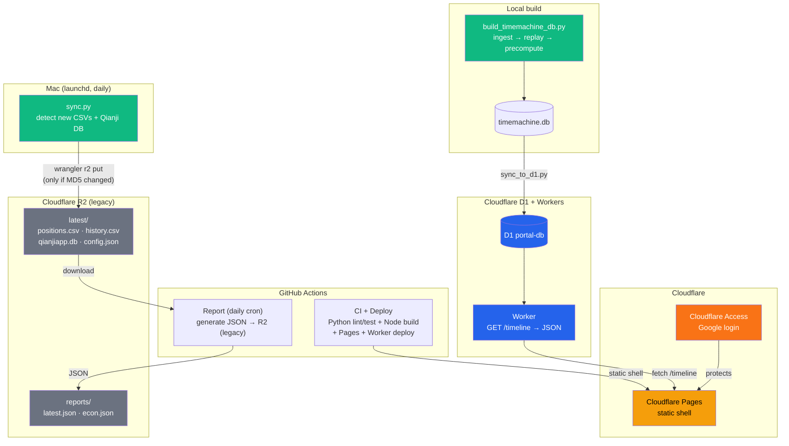
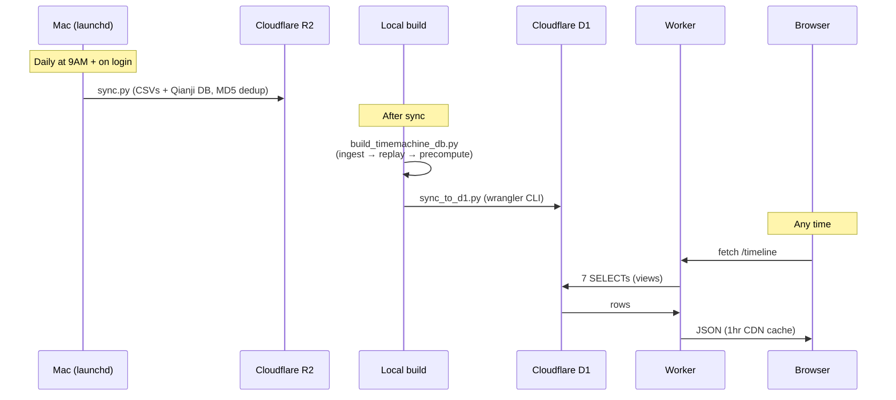
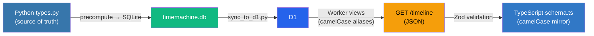

# Portal

Personal one-stop dashboard. Finance reports with live data from Fidelity brokerage + [Qianji](https://qianjiapp.com/) expense tracking + Empower 401k, plus an economic indicators dashboard (FRED). More modules planned.

**Live:** https://portal.guoyuer.com (protected by Cloudflare Access)

## Architecture



**Key design:** Portal is a static shell (HTML + JS) deployed to Cloudflare Pages. The Cloudflare Worker serves `GET /timeline` from D1 (SQLite-compatible). The frontend fetches once on load, then computes allocation, cashflow, activity, and reconciliation locally in `use-bundle.ts`. Brush drag is zero-latency (no network round-trips).

R2 (`latest.json`) is legacy and being phased out in favor of the D1/Worker path.

## Data Pipeline



## Project Structure

```
portal/
├── src/                               # Next.js frontend (TypeScript)
│   ├── app/
│   │   ├── layout.tsx                 # Root layout + sidebar
│   │   ├── page.tsx                   # / → redirects to /finance
│   │   ├── finance/
│   │   │   └── page.tsx               # Finance dashboard (client component)
│   │   └── econ/
│   │       └── page.tsx               # Economy dashboard (FRED charts)
│   ├── components/
│   │   ├── layout/
│   │   │   ├── sidebar.tsx            # Nav sidebar
│   │   │   ├── theme-toggle.tsx       # Dark mode toggle
│   │   │   └── back-to-top.tsx        # Floating scroll-to-top
│   │   ├── finance/
│   │   │   ├── shared.tsx             # SectionHeader, SectionBody, TickerTable
│   │   │   ├── charts.tsx             # Recharts (donut, bar+line, area)
│   │   │   ├── timemachine.tsx        # Brush/traveller date-range selector
│   │   │   ├── metric-cards.tsx       # Portfolio, Net Worth, Savings Rate, Goal
│   │   │   ├── category-summary.tsx   # Allocation table + donut
│   │   │   ├── cash-flow.tsx          # Income/expenses + summary
│   │   │   ├── portfolio-activity.tsx # Activity + ticker tables
│   │   │   ├── market-context.tsx     # Index returns + macro indicators
│   │   │   ├── gain-loss.tsx          # Unrealized gain/loss per holding
│   │   │   ├── annual-summary.tsx     # YTD expenses by category
│   │   │   └── net-worth-growth.tsx   # MoM/YoY growth rates
│   │   ├── econ/
│   │   │   ├── macro-cards.tsx        # Economic snapshot cards
│   │   │   └── time-series-chart.tsx  # Multi-line FRED chart viewer
│   │   └── ui/                        # shadcn/ui (Button, Table)
│   └── lib/
│       ├── use-bundle.ts              # Core data hook: fetch /timeline → local compute
│       ├── schema.ts                  # Zod schemas for timeline API
│       ├── econ-schema.ts             # Zod schemas for economy data
│       ├── types.ts                   # Re-exports from schema.ts
│       ├── config.ts                  # TIMELINE_URL, REPORT_URL (deprecated), GOAL
│       ├── format.ts                  # Currency/percent/yuan formatters
│       ├── hooks.ts                   # Shared React hooks
│       ├── chart-styles.ts            # Recharts theming
│       ├── style-helpers.ts           # CSS helpers
│       └── utils.ts                   # General utilities
│
├── worker/                            # Cloudflare Worker (TypeScript)
│   ├── src/index.ts                   # GET /timeline → 7 D1 SELECTs → JSON
│   ├── schema.sql                     # D1 tables + camelCase views
│   ├── wrangler.toml                  # D1 binding config
│   ├── tsconfig.json
│   └── package.json
│
├── pipeline/                          # Data pipeline + backend (Python)
│   ├── generate_asset_snapshot/       # Core package
│   │   ├── server.py                  # FastAPI backend (local dev, port 8000)
│   │   ├── db.py                      # SQLite schema + connection helpers
│   │   ├── timemachine.py             # Historical replay engine
│   │   ├── allocation.py              # Compute daily per-asset allocation
│   │   ├── precompute.py              # Build computed_* tables (daily, prefix, market)
│   │   ├── incremental.py             # Incremental DB update mode
│   │   ├── prices.py                  # Yahoo Finance price + CNY rate fetcher
│   │   ├── empower_401k.py            # Empower 401k QFX snapshot parser
│   │   ├── types.py                   # Source-of-truth dataclasses
│   │   ├── report.py                  # build_report() → ReportData (legacy)
│   │   ├── portfolio.py               # Load positions from Fidelity CSV
│   │   ├── config.py                  # JSON config loader
│   │   ├── history.py                 # Build chart data (monthly flows)
│   │   ├── analysis.py                # Metrics computation
│   │   ├── renderers/json_renderer.py # dataclasses.asdict() + camelCase
│   │   ├── ingest/
│   │   │   ├── fidelity_history.py    # Fidelity transaction CSV parser
│   │   │   ├── robinhood_history.py   # Robinhood transaction CSV parser
│   │   │   └── qianji_db.py           # Qianji SQLite reader
│   │   ├── market/
│   │   │   ├── yahoo.py               # Yahoo Finance: index returns, CNY rate
│   │   │   └── fred.py                # FRED API: Fed rate, CPI, VIX, oil, etc.
│   │   └── core/reconcile.py          # Qianji ↔ Fidelity cross-reconciliation
│   ├── scripts/
│   │   ├── build_timemachine_db.py    # Main build: ingest → replay → precompute → SQLite
│   │   ├── sync_to_d1.py             # Push timemachine.db tables to D1
│   │   ├── send_report.py             # Generate report JSON (legacy R2 path)
│   │   ├── sync.py                    # Mac/Win → R2 (wrangler CLI, MD5 dedup)
│   │   ├── verify_positions.py        # Verify Fidelity replay accuracy
│   │   ├── verify_qianji.py           # Verify Qianji replay accuracy
│   │   ├── create_test_db.py          # Generate test fixture DB
│   │   ├── install_launchd.sh         # macOS scheduled sync
│   │   └── install_task.ps1           # Windows Task Scheduler setup
│   ├── tests/                         # 24 test files
│   │   ├── unit/                      # Unit tests (20 files)
│   │   ├── contract/                  # Data invariant tests
│   │   ├── e2e/                       # Server integration tests
│   │   └── fixtures/                  # Sample CSVs, QFX files
│   ├── data/
│   │   └── timemachine.db             # Generated SQLite (not in repo)
│   ├── pyproject.toml                 # pytest, mypy, ruff config
│   ├── requirements.txt               # yfinance, fredapi, fastapi, uvicorn
│   └── config.example.json            # Template config
│
├── e2e/                               # Playwright e2e tests
│   ├── finance.spec.ts                # Finance dashboard tests
│   ├── econ.spec.ts                   # Economy dashboard tests
│   ├── perf-brush.spec.ts             # Brush performance tests
│   └── interactive-check.spec.ts      # Interactive component tests
│
├── .github/workflows/
│   ├── ci.yml                         # Python + Node CI → Pages + Worker deploy
│   └── report.yml                     # Daily: generate report JSON → R2 (legacy)
│
└── package.json
```

## Type Contract

Zero translation layer between Python and TypeScript:



- Python `snake_case` → D1 views `camelCase` aliases → TypeScript `camelCase`
- Frontend validates with Zod schemas (`schema.ts`)
- Raw transaction lists are included for local computation in `use-bundle.ts`
- No manual field mapping, no divergent schemas

## Tech Stack

| Layer | Choice | Why |
|-------|--------|-----|
| Frontend | Next.js 16 (App Router) | React 19, file-based routing |
| Charts | Recharts 3 | Lightweight, React-native, ComposedChart for mixed bar+line |
| Validation | Zod 4 | Runtime schema validation for API responses |
| Data | `use-bundle.ts` → Worker `/timeline` | Fetch once, compute locally, zero-lag brush |
| Styling | Tailwind CSS v4 + shadcn/ui | Utility-first, dark mode support |
| Hosting | Cloudflare Pages + Workers | Edge CDN, D1 SQLite, free tier |
| Storage | Cloudflare D1 (primary), R2 (legacy) | D1 for structured data, R2 being phased out |
| Auth | Cloudflare Access | Zero-trust, Google login |
| Backend | FastAPI (local dev) | Serves timemachine.db for local development |
| Pipeline | Python 3.14 | Fidelity/Qianji/Robinhood/401k ingest, Yahoo Finance, FRED API |
| CI/CD | GitHub Actions | Single workflow: test → build → deploy (Pages + Worker) |
| Tests | Playwright (4 specs) + pytest (24 test files) | E2E browser tests + Python unit/contract/e2e tests |

## Development

```bash
# Install
npm install
cd pipeline && python3 -m venv .venv && .venv/bin/pip install -r requirements.txt

# Config (copy template and fill in your accounts)
cp pipeline/config.example.json pipeline/config.json

# Environment (create .env.local)
cat > .env.local <<EOF
NEXT_PUBLIC_TIMELINE_URL=http://localhost:8000/timeline
NEXT_PUBLIC_R2_URL=https://your-r2-url.r2.dev
EOF

# Local backend (serves timemachine.db on port 8000)
cd pipeline && .venv/bin/python -m generate_asset_snapshot.server

# Dev server (fetches from TIMELINE_URL)
npm run dev              # http://localhost:3000

# Run tests
cd pipeline && .venv/bin/pytest -q                          # Python tests
cd pipeline && .venv/bin/mypy generate_asset_snapshot/ --ignore-missing-imports
cd pipeline && .venv/bin/ruff check .
npx next build && npx playwright test                       # e2e tests

# Build timemachine DB from raw data
cd pipeline && python3 scripts/build_timemachine_db.py

# Sync DB to Cloudflare D1
cd pipeline && python3 scripts/sync_to_d1.py

# Manual sync raw data to R2 (legacy)
cd pipeline && python3 scripts/sync.py --force
```

## Setup (one-time)

1. **Cloudflare D1**: `cd worker && npx wrangler d1 create portal-db`, apply schema: `npx wrangler d1 execute portal-db --remote --file=schema.sql`
2. **Cloudflare R2** (legacy): Create bucket, enable public access, set CORS
3. **Environment**: Set `NEXT_PUBLIC_TIMELINE_URL` (Worker URL) in `.env.local` and as GitHub secret
4. **Custom domain** (optional): Add `portal.yourdomain.com` to Pages project
5. **Cloudflare Access** (optional): Zero Trust → Add Google IdP → Access Application
6. **GitHub Secrets**: `CLOUDFLARE_ACCOUNT_ID`, `CLOUDFLARE_API_TOKEN`, `NEXT_PUBLIC_TIMELINE_URL`, `NEXT_PUBLIC_R2_URL`, `FRED_API_KEY`
7. **Config**: Copy `config.example.json` → `config.json`, fill in your accounts
8. **Mac sync**: `wrangler login && bash pipeline/scripts/install_launchd.sh`
9. **First build**: `cd pipeline && python3 scripts/build_timemachine_db.py && python3 scripts/sync_to_d1.py`

## Adding a New Module

```
src/app/{module}/page.tsx        ← route + UI
src/lib/{module}-schema.ts       ← Zod schemas
src/components/{module}/         ← components
e2e/{module}.spec.ts             ← tests
pipeline/...                     ← data generation (if needed)
```

## TODO

- [ ] Gmail module — important email auto-triage
- [ ] News aggregation — RSS feeds
- [x] Economic indicators dashboard — FRED time series charts (`/econ`)
- [x] FRED API integration — Fed rate, CPI, VIX, oil, unemployment, Treasury yields
- [x] Timemachine — historical portfolio replay with brush navigation
- [x] Cloudflare D1 + Workers migration — replace local FastAPI for production
- [x] Robinhood transaction ingestion
- [x] Empower 401k QFX integration
- [ ] AI-generated macro narrative — LLM summarizing economic conditions and cycle position
- [ ] Drop R2 legacy path — remove REPORT_URL, ECON_URL, report.yml workflow

## License

[MIT](LICENSE)
