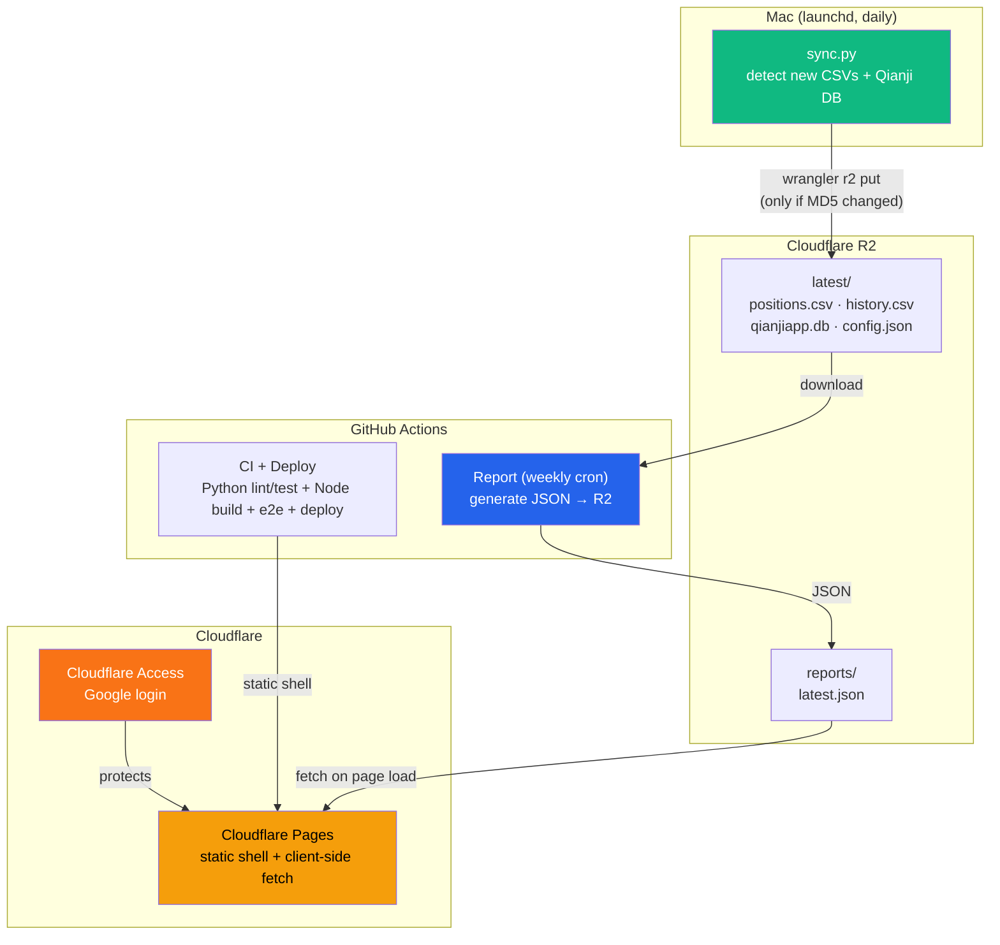
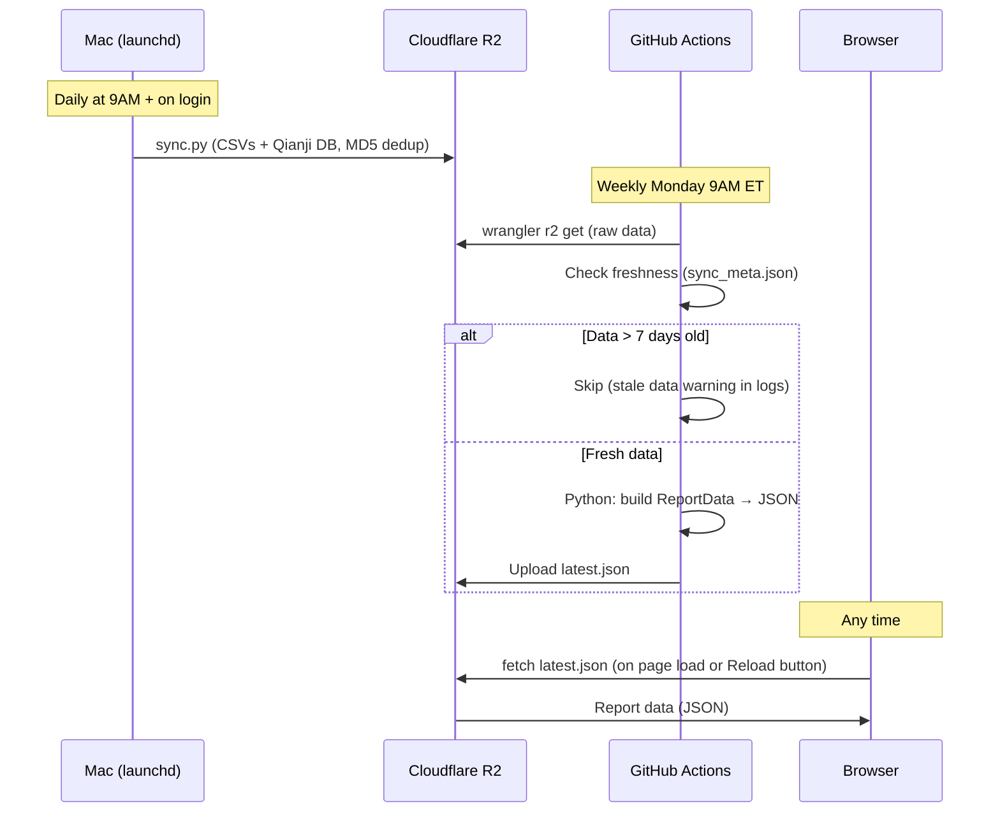
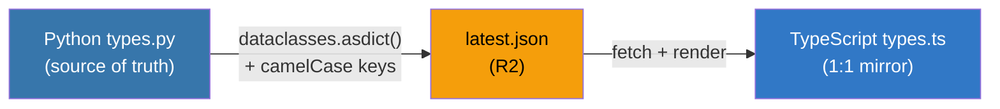
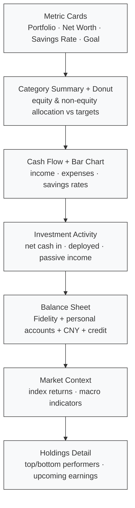

# Portal

Personal one-stop dashboard. Finance reports with live data from Fidelity brokerage + [Qianji](https://qianjiapp.com/) expense tracking, with more modules planned.

**Live:** https://portal.guoyuer.com (protected by Cloudflare Access)

## Architecture



**Key design:** Portal is a static shell (HTML + JS) deployed to Cloudflare Pages. On every page load, the browser fetches the latest report data directly from R2. No rebuild needed when data changes — only when code changes.

## Data Pipeline



## Project Structure

```
portal/
├── src/                               # Next.js frontend (TypeScript)
│   ├── app/
│   │   ├── layout.tsx                 # Root layout + sidebar
│   │   ├── page.tsx                   # / → redirects to /finance
│   │   └── finance/
│   │       └── page.tsx               # Finance report (client component, fetches R2)
│   ├── components/
│   │   ├── layout/
│   │   │   ├── sidebar.tsx            # Nav sidebar
│   │   │   └── theme-toggle.tsx       # Dark mode toggle
│   │   ├── finance/charts.tsx         # Recharts (donut, bar+line, area)
│   │   └── ui/                        # shadcn/ui (Card, Table, Badge, Button)
│   └── lib/
│       ├── types.ts                   # 1:1 camelCase mirror of Python ReportData
│       ├── config.ts                  # R2 URL from env var
│       └── format.ts                  # Currency/percent/yuan formatters
│
├── pipeline/                          # Report generation (Python)
│   ├── generate_asset_snapshot/       # Core package
│   │   ├── report.py                  # build_report() → ReportData
│   │   ├── types.py                   # Source-of-truth dataclasses
│   │   ├── renderers/json_renderer.py # dataclasses.asdict() + camelCase (~20 lines)
│   │   ├── ingest/                    # Fidelity CSV + Qianji SQLite parsers
│   │   ├── market/yahoo.py            # Yahoo Finance: index returns, CNY rate
│   │   ├── ai/                        # Optional AI features (narrative, classify)
│   │   └── core/reconcile.py          # Qianji ↔ Fidelity cross-reconciliation
│   ├── scripts/
│   │   ├── sync.py                    # Mac → R2 (wrangler CLI, MD5 dedup, macOS notifications)
│   │   ├── send_report.py             # Generate report JSON from data files
│   │   └── install_launchd.sh         # macOS scheduled sync setup
│   ├── tests/                         # 140 Python tests
│   ├── config.example.json            # Template config (copy to config.json)
│   └── requirements.txt               # yfinance, fredapi
│
├── e2e/
│   └── finance.spec.ts                # 28 Playwright e2e tests
│
├── .github/workflows/
│   ├── ci.yml                         # Python + Node CI → deploy (single workflow)
│   └── report.yml                     # Weekly: generate report JSON → upload to R2
│
└── package.json
```

## Type Contract

Zero translation layer between Python and TypeScript:



- Python `snake_case` → JSON `camelCase` → TypeScript `camelCase`
- JSON renderer is ~20 lines (`dataclasses.asdict()` + recursive key conversion)
- Raw transaction lists stripped from JSON (portal uses pre-computed aggregations)
- No manual field mapping, no divergent schemas

## Report Sections



Features:
- **Dark mode** toggle (persists to localStorage)
- **Reload button** — fetch fresh data from R2 without page refresh
- **Data timestamps** — shows when each data source was last updated
- **Collapsible rows** — expenses < $200 and activity tickers beyond top 5
- **Mobile responsive** — adaptive layout, hidden columns, scrollable tables

## Tech Stack

| Layer | Choice | Why |
|-------|--------|-----|
| Frontend | Next.js 15 (App Router) | React ecosystem, file-based routing |
| Charts | Recharts | Lightweight, React-native, ComposedChart for mixed bar+line |
| Data | Client-side fetch from R2 | No rebuild needed for data updates |
| Styling | Tailwind CSS v4 + shadcn/ui | Utility-first, dark mode support |
| Hosting | Cloudflare Pages | Edge CDN, free tier, static shell |
| Storage | Cloudflare R2 | S3-compatible, free 10GB, CORS enabled |
| Auth | Cloudflare Access | Zero-trust, Google login |
| Pipeline | Python 3.14 | Fidelity/Qianji parsing, Yahoo Finance API |
| CI/CD | GitHub Actions | Single workflow: test → build → deploy |
| Tests | Playwright (28) + pytest (140) | E2E browser tests + Python unit tests |

## Development

```bash
# Install
npm install
cd pipeline && python3 -m venv .venv && .venv/bin/pip install -r requirements.txt

# Config (copy template and fill in your accounts)
cp pipeline/config.example.json pipeline/config.json

# Environment (create .env.local with your R2 URL)
echo "NEXT_PUBLIC_R2_URL=https://your-r2-url.r2.dev" > .env.local

# Dev server (fetches live data from R2)
npm run dev              # http://localhost:3000

# Run tests
npx next build && npx playwright test                     # 28 e2e tests
cd pipeline && .venv/bin/pytest -q                         # 140 Python tests
cd pipeline && .venv/bin/mypy generate_asset_snapshot/      # type check
cd pipeline && .venv/bin/ruff check .                       # lint

# Manual sync to R2
cd pipeline && python3 scripts/sync.py --force
```

## Setup (one-time)

1. **Cloudflare R2**: Create bucket, enable public access (r2.dev URL), set CORS `AllowedOrigins: ["*"]`
2. **Environment**: Set `NEXT_PUBLIC_R2_URL` in `.env.local` and as GitHub secret
3. **Custom domain** (optional): Add `portal.yourdomain.com` to Pages project
4. **Cloudflare Access** (optional): Zero Trust → Add Google IdP → Access Application
5. **GitHub Secrets**: `CLOUDFLARE_ACCOUNT_ID`, `CLOUDFLARE_API_TOKEN` (Pages + R2 Edit), `NEXT_PUBLIC_R2_URL`
6. **Config**: Copy `config.example.json` → `config.json`, fill in your accounts
7. **Mac sync**: `wrangler login && bash pipeline/scripts/install_launchd.sh`
8. **First sync**: `cd pipeline && python3 scripts/sync.py --force`

## Adding a New Module

```
src/app/{module}/page.tsx        ← route + UI
src/lib/{module}-config.ts       ← data loading
e2e/{module}.spec.ts             ← tests
pipeline/...                     ← data generation (if needed)
```

## TODO

- [ ] Gmail module — important email auto-triage
- [ ] News aggregation — RSS feeds
- [ ] Economic indicators dashboard — FRED time series charts
- [ ] Net Worth Trend chart — needs historical snapshot data

## License

[MIT](LICENSE)
