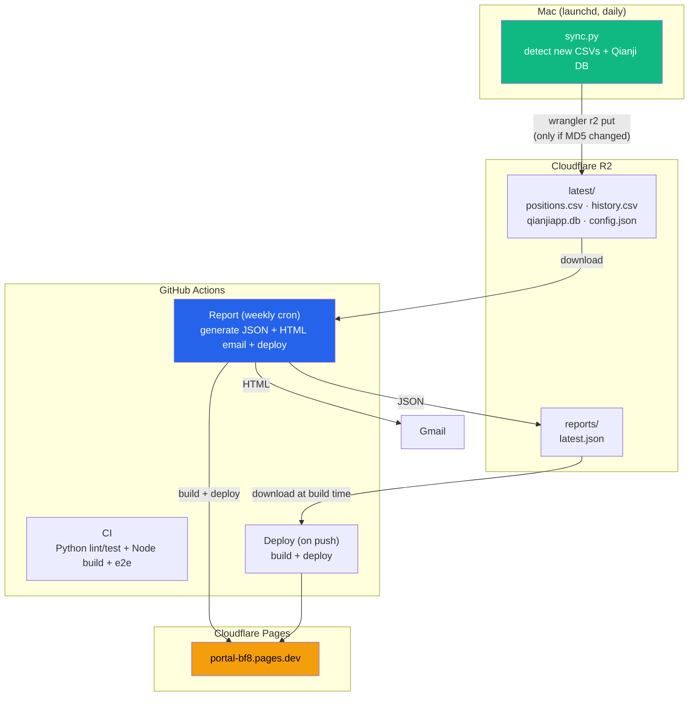
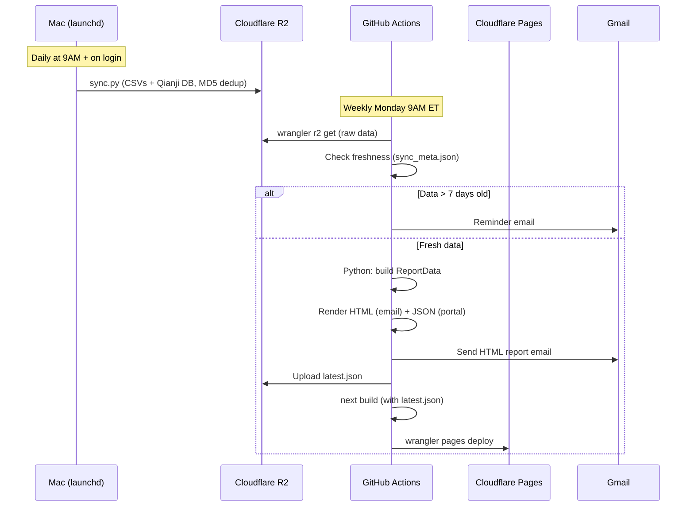
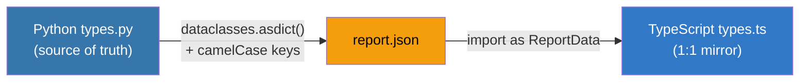
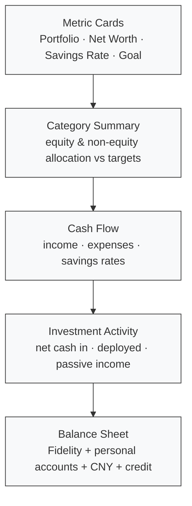

# Portal

Personal one-stop dashboard. Finance reports with live data from Fidelity + Qianji, with email triage, news, and economic analysis planned.

**Live:** https://portal-bf8.pages.dev

## Architecture



## Data Pipeline



## Project Structure

```
portal/
├── src/                               # Next.js frontend (TypeScript)
│   ├── app/
│   │   ├── layout.tsx                 # Root layout + sidebar
│   │   ├── page.tsx                   # / → redirects to /finance
│   │   └── finance/
│   │       └── page.tsx               # Finance report page
│   ├── components/
│   │   ├── layout/sidebar.tsx         # Nav sidebar (Client Component)
│   │   └── ui/                        # shadcn/ui (Card, Table, Badge, etc.)
│   └── lib/
│       ├── types.ts                   # 1:1 camelCase mirror of Python ReportData
│       ├── data.ts                    # Loads report-data.json
│       └── format.ts                  # Currency/percent/yuan formatters
│
├── pipeline/                          # Report generation (Python)
│   ├── generate_asset_snapshot/       # Core package
│   │   ├── report.py                  # build_report() → ReportData
│   │   ├── types.py                   # Source-of-truth dataclasses
│   │   ├── renderers/
│   │   │   ├── html.py                # Email-safe HTML renderer
│   │   │   └── json_renderer.py       # dataclasses.asdict() + camelCase (~20 lines)
│   │   ├── ingest/                    # Fidelity CSV + Qianji DB parsers
│   │   ├── market/                    # Yahoo Finance + FRED APIs
│   │   └── ...
│   ├── scripts/
│   │   ├── sync.py                    # Mac → R2 (wrangler CLI, MD5 dedup)
│   │   ├── send_report.py             # Generate HTML + JSON, send email
│   │   └── install_launchd.sh         # macOS scheduled sync setup
│   ├── tests/                         # 201 Python tests
│   ├── config.json                    # Asset classification config
│   └── requirements.txt               # yfinance, fredapi
│
├── e2e/
│   └── finance.spec.ts                # 19 Playwright e2e tests
│
├── .github/workflows/
│   ├── ci.yml                         # Python (pytest/mypy/ruff) + Node (build + e2e)
│   ├── deploy.yml                     # Download JSON from R2 → build → deploy
│   └── report.yml                     # Weekly: generate report → email → R2 → deploy
│
└── package.json
```

## Type Contract

Zero translation layer between Python and TypeScript:



- Python `snake_case` → JSON `camelCase` → TypeScript `camelCase`
- JSON renderer is ~20 lines (`dataclasses.asdict()` + recursive key conversion)
- Raw transaction lists stripped from JSON (portal uses pre-computed aggregations)
- No manual field mapping, no divergent schemas

## Report Sections



Collapsible rows (native `<details>`) for expenses < $200 and activity tickers beyond top 5.

## Tech Stack

| Layer | Choice | Why |
|-------|--------|-----|
| Frontend | Next.js 15 (App Router) | Marketable, React ecosystem, file-based routing |
| Styling | Tailwind CSS v4 + shadcn/ui | Utility-first, copy-paste components |
| Fonts | Geist Sans + Geist Mono | Clean, designed for dashboards |
| Hosting | Cloudflare Pages | Edge CDN, free tier, no cold starts |
| Storage | Cloudflare R2 | S3-compatible, free 10GB, no pausing |
| Pipeline | Python 3.14 | Fidelity/Qianji parsing, Yahoo/FRED APIs |
| CI | GitHub Actions | Python quality gates + Node build + Playwright e2e |
| E2E Tests | Playwright (19 tests) | Full browser testing in CI |
| Auth (planned) | Cloudflare Access | Zero-trust, Google login |
| Database (planned) | Cloudflare D1 (SQLite) | For future modules (mail, news, econ) |

## Development

```bash
# Install
npm install
cd pipeline && python3 -m venv .venv && .venv/bin/pip install -r requirements.txt

# Generate report data (required before build)
npm run generate-data

# Dev server
npm run dev              # http://localhost:3000

# Run tests
npx next build && npx playwright test        # 19 e2e tests
cd pipeline && .venv/bin/pytest -q            # 201 Python tests

# Manual sync to R2
cd pipeline && python3 scripts/sync.py --force
```

## Setup (one-time)

1. **Cloudflare R2**: Create bucket `asset-snapshot-data` in dashboard
2. **GitHub Secrets**: `CLOUDFLARE_ACCOUNT_ID`, `CLOUDFLARE_API_TOKEN` (Pages + R2 Edit), `GMAIL_ADDRESS`, `GMAIL_APP_PASSWORD`
3. **Mac sync**: `wrangler login && bash pipeline/scripts/install_launchd.sh`
4. **First sync**: `cd pipeline && python3 scripts/sync.py --force`

## Adding a New Module

```
src/app/{module}/page.tsx        ← route + UI
src/lib/{module}-data.ts         ← data loading
e2e/{module}.spec.ts             ← tests
pipeline/...                     ← data generation (if needed)
```

Planned: **Mail** (Gmail API + AI triage), **News** (RSS aggregation), **Economy** (FRED/Yahoo dashboard).
