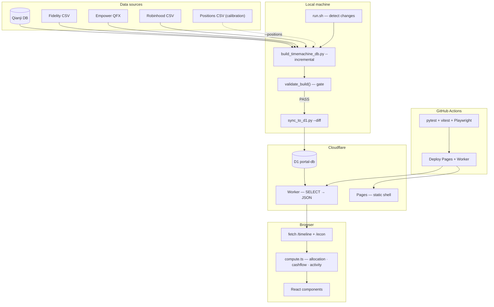

# Portal Architecture

Personal finance dashboard: Next.js 16 static shell + Cloudflare Worker/D1.

## System overview



**Principles:** D1 is persistent store, local DB is disposable cache. Diff sync pushes only new rows. Worker is pure passthrough. Frontend computes everything locally after one fetch. Positions CSV calibration is optional.

---

## D1 schema

| Table | Purpose | Sync strategy |
|-------|---------|---------------|
| `computed_daily` | Daily totals + 4 categories + liabilities | INSERT OR IGNORE |
| `computed_daily_tickers` | Per-day per-ticker value, cost basis | INSERT OR IGNORE |
| `fidelity_transactions` | Classified records (runDate, actionType, symbol, amount) | Range replace |
| `qianji_transactions` | Records (date, type, category, amount) | Range replace |
| `computed_market_indices` | Index returns + sparklines | Full replace |
| `computed_market_indicators` | Scalar FRED indicators | Full replace |
| `computed_holdings_detail` | Per-ticker performance | Full replace |
| `econ_series` | FRED monthly time-series (9 keys, ~540 rows) | Full replace |
| `sync_meta` | last_sync timestamp, last_date coverage | Full replace |
| `replay_checkpoint` | Cached positions/cash/cost_basis (local only) | Not synced |
| `calibration_log` | Drift between replay and positions CSV (local only) | Not synced |

Worker endpoints: `GET /timeline` (7 parallel SELECTs → JSON, ~4.6 MB / ~385 KB gzip), `GET /econ` (econ_series → grouped by key).

---

## How net worth is computed

`computed_daily.total` = sum of all positive-value tickers, from five sources:

| Source | Method |
|--------|--------|
| Fidelity | Forward replay → `(account, symbol) → qty` × `daily_close` price |
| Fidelity cash | Forward replay → per-account balance, mapped to money market |
| Qianji | Reverse replay from current balances, CNY at historical rate |
| Empower 401k | QFX snapshots + proxy interpolation + contribution fallback |
| Robinhood | Forward replay → `symbol → qty` × `daily_close` price |

`netWorth = total + liabilities` (credit cards from Qianji, negative).

---

## Frontend data flow

All computation is client-side after a single fetch. Zero network during brush interaction:

1. `GET /timeline` → parse with Zod `TimelineDataSchema`
2. Build indexes: `dateIndex` (date → array position), `tickerIndex` (date → tickers)
3. Brush drag → slice `daily[brushStart..brushEnd]` for chart zoom
4. Point-in-time: `daily[brushEnd]` → allocation, snapshot
5. Time-range: iterate `fidelityTxns` / `qianjiTxns` → cashflow, activity, cross-check

All in `compute.ts` — pure functions, no network, <1ms for 3 years of data.

---

## Pipeline commands

```bash
# Full rebuild
python scripts/build_timemachine_db.py

# Incremental (only new days)
python scripts/build_timemachine_db.py incremental

# With calibration
python scripts/build_timemachine_db.py incremental --positions Portfolio_Positions.csv

# Sync to D1 (full replace)
python scripts/sync_to_d1.py

# Sync to D1 (diff — only new rows)
python scripts/sync_to_d1.py --diff --since 2026-04-01

# Automated pipeline (detect changes → build → sync)
./scripts/run.sh
```

CLI flags: `--data-dir`, `--config`, `--downloads`, `--no-validate`, `--csv <path>`.

---

## Validation gate

`validate_build()` runs after build, blocks sync on FATAL:

| Check | Severity | Threshold |
|-------|----------|-----------|
| total ≈ SUM(tickers) per date | FATAL | >$1 diff |
| Day-over-day change | FATAL / WARNING | >20% AND >$10K / >15% AND >$5K |
| Holdings > $100 have recent price | FATAL | Missing from daily_close |
| CNY rate freshness | WARNING | >7 days stale |
| Date gaps | WARNING | >7 calendar days |

---

## Replay verification

| Check | Result |
|-------|--------|
| Fidelity positions (36 symbols) | Exact match |
| Fidelity cash (3 accounts) | Exact match |
| 401k at 12 QFX boundaries | Zero error |
| Allocation vs live site | <1.5pp per category |

---

## Tech stack

| Layer | Technology |
|-------|-----------|
| Frontend | Next.js 16 (static export), React 19, Recharts, Tailwind v4 |
| Backend | Cloudflare Worker + D1 (edge SQLite) |
| Pipeline | Python 3.14, SQLite, yfinance, fredapi |
| CI | GitHub Actions: pytest + vitest + Playwright (mock API) |
| Deploy | Cloudflare Pages + Workers |

Enabled: React Compiler (auto-memo), View Transitions, content-visibility auto.

---

## Remaining ideas (not planned)

- Speculation Rules API (prerender /econ from /finance)
- D1 Global Read Replication (only useful if traveling)
- ECharts/Nivo (only if Recharts hits perf limits at >5K points)
- Container Queries for metric cards (grid layout already sufficient)
