# Architecture

Portal is a static Next.js 16 dashboard backed by precomputed JSON artifacts in Cloudflare R2.

## Data Flow

```mermaid
graph LR
    RAW["Broker/Qianji/FRED/Yahoo inputs"] --> BUILD["build_timemachine_db.py"]
    BUILD --> DB["timemachine.db"]
    DB --> EXPORT["r2_artifacts.py export"]
    EXPORT --> VERIFY["verify hashes + row counts + Zod"]
    VERIFY --> R2["R2 portal-data<br/>manifest.json + snapshots"]
    R2 --> WORKER["portal-api Worker"]
    WORKER --> API["/api/timeline /api/econ /api/prices"]
    API --> UI["Next.js static UI"]
```



The local SQLite DB is the source of truth and remains the SQL debugging surface. Production serving does not query SQL. The Worker streams endpoint-shaped R2 objects selected by the active `manifest.json`.

## Publication Model

Publication is manifest-last:

1. Build or refresh `pipeline/data/timemachine.db`.
2. Export endpoint JSON into `pipeline/artifacts/r2/snapshots/<version>/`.
3. Verify local artifacts:
   - descriptor hashes and byte counts
   - SQLite row counts vs JSON row counts
   - latest computed date
   - frontend Zod schema compatibility
4. Publish snapshot objects to R2.
5. Read back snapshot objects and verify hashes.
6. Publish `manifest.json` last.

This avoids mutable production table sync. Users either see the old manifest or the new manifest; no partially published snapshot becomes active.

## Runtime Endpoints

| Endpoint | Artifact |
| --- | --- |
| `/api/timeline` | `snapshots/<version>/timeline.json` |
| `/api/econ` | `snapshots/<version>/econ.json` |
| `/api/prices` | `snapshots/<version>/prices.json` |

The Worker strips an optional `/api` prefix, validates only manifest shape, streams R2 bodies with `no-store` headers, and returns explicit 5xx for missing/invalid manifest or referenced objects. It intentionally does not cache endpoint responses, so a manifest flip is not masked by stale Worker cache entries. Frontend Zod parsing remains the runtime data-contract checkpoint.

## SQLite Shape Layer

`pipeline/etl/db.py` creates base tables and local SQLite projection views such as `v_daily`, `v_daily_tickers`, `v_fidelity_txns`, `v_econ_series_grouped`, and `v_econ_snapshot`. The exporter reads those projections to preserve the API contract.

The views are local implementation detail now. They are not deployed as a production schema.

## Frontend Compute

Frontend fetches `/timeline` once and computes:

- allocation and net-worth snapshots
- monthly cashflow and savings rate
- activity rows
- grouped activity for equivalent ticker groups
- Fidelity/Robinhood deposit reconciliation vs Qianji

Ticker/group charts lazily load `/prices`, then select the ticker client-side. Brush drag is local state and has no network round-trip.

## Automation

`pipeline/scripts/run_automation.py` owns the unattended flow:

```text
detect changes -> build_timemachine_db.py -> optional verify_positions.py -> r2_artifacts.py export -> verify -> publish
```

`--dry-run` stops before publish. `--local` publishes to local Miniflare R2 for local Worker/e2e testing.

## Correctness Gates

- Build validation in `etl.validate` catches portfolio/accounting issues before artifacts are exported.
- Regression tests cover fixture-based row and golden-output behavior.
- `r2_artifacts.py verify` blocks publish if JSON payloads do not match SQLite counts, latest date, descriptor hashes, or frontend schemas.
- Remote publish readback verifies R2 bytes before `manifest.json` is flipped.
- A single-publisher lock prevents concurrent publish processes from racing manifest updates.

## Cloudflare

- Pages serves the static shell.
- Worker `portal-api` serves `/api/*`.
- R2 bucket `portal-data` stores active and historical snapshots.
- Cloudflare Access protects `portal.guoyuer.com/*`.

CI deploys Pages. Worker deploy is manual with `cd worker && npx wrangler deploy`.

## R2 Usage Envelope

The current snapshot is about 8 MiB (`timeline.json`, `econ.json`, `prices.json`). Daily retained snapshots add about 2.8 GiB/year. Because endpoint responses are not Worker-cached, each endpoint request performs two R2 reads: `manifest.json` plus the referenced artifact. A normal dashboard load plus the first ticker/group chart is roughly 4 Class B operations, which is comfortably within R2's monthly free tier for personal use.
