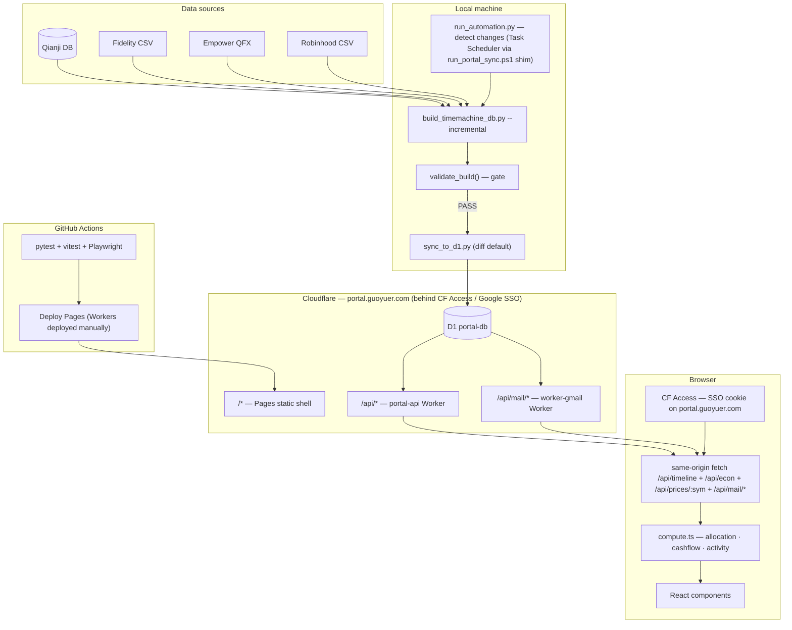

# Portal Architecture

Personal finance dashboard: Next.js 16 static shell + Cloudflare Worker/D1.

## System overview



**Principles:** D1 is persistent store, local DB is disposable cache. Diff sync pushes only new rows. Workers are thin adapters (shape work in D1 views, Zod validation at boundary). Frontend computes everything locally after one fetch.

**Routing (2026-04-13 migration):** Both Workers mount as **zone routes on `portal.guoyuer.com`** — same origin as Pages. `portal.guoyuer.com/api/*` → portal-api; `portal.guoyuer.com/api/mail/*` → worker-gmail. One CF Access app on `portal.guoyuer.com` authenticates the page load and every subsequent API call with the same session cookie — no CORS preflight, no cross-subdomain cookie handshake. Only exception: `portal-mail.guoyuer.com/mail/sync` stays on a separate hostname with no Access in front so the GitHub Actions Gmail cron can reach it with just the `X-Sync-Secret` header. See `docs/archive/security-worker-backdoor-2026-04-12.md` for the history.

---

## D1 schema

| Table | Purpose | Sync strategy |
|-------|---------|---------------|
| `computed_daily` | Daily totals + 4 categories + liabilities | INSERT OR IGNORE |
| `computed_daily_tickers` | Per-day per-ticker value, cost basis | INSERT OR IGNORE |
| `fidelity_transactions` | Classified records (runDate ISO, actionType, symbol, amount) | Range replace |
| `qianji_transactions` | Records (date, type, category, amount, isRetirement) | Range replace |
| `daily_close` | Per-symbol daily close prices (cache for ticker charts) | Diff replace |
| `categories` | Allocation metadata (key, name, displayOrder, targetPct) from `config.json` | Full replace |
| `computed_market_indices` | Index returns + sparklines | Full replace |
| `computed_holdings_detail` | Per-ticker performance | Full replace |
| `econ_series` | Monthly time-series — FRED macro keys + `dxy` (Yahoo) + `usdCny` (Yahoo) | Full replace |
| `sync_meta` | last_sync timestamp, last_date coverage | Full replace |
| `sync_log` | Append-only audit trail of D1 schema changes + sync runs | Not synced (D1-only) |

D1 has 10 camelCase views — `v_daily`, `v_daily_tickers`, `v_fidelity_txns`, `v_qianji_txns`, `v_categories`, `v_market_indices`, `v_holdings_detail`, `v_econ_series`, `v_econ_series_grouped`, `v_econ_snapshot`.

Worker endpoints. Path-handling differs by Worker: portal-api strips `/api/` internally (so handlers match on `/timeline`, `/econ`, `/prices/:sym`); worker-gmail matches the full incoming path literally (post-PR #141), so browser routes are `/api/mail/list` + `/api/mail/trash` and the cron route is bare `/mail/sync` — the two prefixes disambiguate audience:

- `GET /api/timeline` — parallel SELECTs across critical + optional views, ~4.6 MB / ~385 KB gzip
- `GET /api/econ` — econ_series snapshot + grouped series (includes `dxy`, `usdCny` alongside FRED keys)
- `GET /api/prices/:symbol` — daily close + transactions, on-demand per ticker click
- `GET /api/mail/list`, `POST /api/mail/trash` — Gmail triage (worker-gmail, browser, CF Access)
- `POST /mail/sync` on `portal-mail.guoyuer.com` — GitHub Actions cron upserts classifications (SYNC_SECRET)

All responses pass through `safeParse` at the Worker boundary — schema drift returns HTTP 500 with the Zod path instead of a silently garbage body.

`/api/timeline` is fail-open: the critical `v_daily` query returns 503 on failure, but optional sections (market, holdings, txns) degrade to `null` + an `errors: { market?, holdings?, txns? }` entry. Frontend panels render explicit error cards — missing data never hides silently.

---

## How net worth is computed

`computed_daily.total` = sum of all positive-value tickers, from five sources:

| Source | Method |
|--------|--------|
| Fidelity | Forward replay → `(account, symbol) → qty` × `daily_close` price |
| Fidelity cash | Forward replay → per-account balance, mapped to money market |
| Qianji | Reverse replay from current balances, CNY at historical rate |
| Empower 401k | QFX snapshots + proxy interpolation + contribution fallback |
| Robinhood | Forward replay → `symbol → qty` × `daily_close` price |

`netWorth = total + liabilities` (credit cards from Qianji, negative).

---

## Frontend data flow

All computation is client-side after a single fetch. Zero network during brush interaction:

1. `GET /timeline` → parse with Zod `TimelineDataSchema`
2. Build indexes: `dateIndex` (date → array position), `tickerIndex` (date → tickers)
3. Brush drag → slice `daily[brushStart..brushEnd]` for chart zoom
4. Point-in-time: `daily[brushEnd]` → allocation, snapshot
5. Time-range: iterate `fidelityTxns` / `qianjiTxns` → cashflow, activity, cross-check

All in `compute.ts` — pure functions, no network, <1ms for 3 years of data.

---

## Pipeline commands

```bash
# Full rebuild
python scripts/build_timemachine_db.py

# Incremental (only new days)
python scripts/build_timemachine_db.py incremental

# Sync to D1 (diff — default; range-replace with auto-derived --since)
python scripts/sync_to_d1.py

# Sync to D1 (explicit cutoff)
python scripts/sync_to_d1.py --since 2026-04-01

# Sync to D1 (DESTRUCTIVE full-replace — requires explicit flag)
python scripts/sync_to_d1.py --full

# Automated pipeline (detect changes → build → verify → sync)
# Orchestration lives in run_automation.py. Task Scheduler invokes the PS1 shim,
# which just forwards args to this script.
python scripts/run_automation.py                # default (live D1)
python scripts/run_automation.py --dry-run      # build + verify, skip sync
python scripts/run_automation.py --force --local  # bypass change detection, push to local D1
```

CLI flags: `--data-dir`, `--config`, `--downloads`, `--no-validate`, `--csv <path>`.

---

## Validation gate

`validate_build()` runs after build, blocks sync on FATAL:

| Check | Severity | Threshold |
|-------|----------|-----------|
| total ≈ SUM(tickers) per date | FATAL | >$1 diff |
| Day-over-day change | FATAL / WARNING | >20% AND >$10K / >15% AND >$5K (anchored to the latest `computed_daily` date; anomalies older than 7 days are suppressed — old 401k-snapshot step-functions aren't actionable) |
| Holdings > $100 have recent price | FATAL | Missing from daily_close |
| CNY rate freshness | WARNING | >7 days stale |
| Date gaps | WARNING | >7 calendar days |

---

## Replay verification

| Check | Result |
|-------|--------|
| Fidelity positions (36 symbols) | Exact match |
| Fidelity cash (3 accounts) | Exact match |
| 401k at 12 QFX boundaries | Zero error |
| Allocation vs live site | <1.5pp per category |

---

## Tech stack

| Layer | Technology |
|-------|-----------|
| Frontend | Next.js 16 (static export), React 19, Recharts, Tailwind v4 |
| Backend | Cloudflare Worker + D1 (edge SQLite) |
| Pipeline | Python 3.14, SQLite, yfinance, fredapi |
| CI | GitHub Actions: pytest + vitest + Playwright (mock API) |
| Deploy | Cloudflare Pages (CI, on push to main) + Workers (manual `wrangler deploy` — CI's `CLOUDFLARE_API_TOKEN` lacks `Zone → Workers Routes → Edit`) |
| Auth | Cloudflare Access (Google SSO, allow-list = `guoyuer1@gmail.com`) on `portal.guoyuer.com/*` — gates page load and every `/api/*` call with the same session cookie |

Enabled: React Compiler (auto-memo), View Transitions, content-visibility auto.

---

## Remaining ideas (not planned)

- Speculation Rules API (prerender /econ from /finance)
- D1 Global Read Replication (only useful if traveling)
- ECharts/Nivo (only if Recharts hits perf limits at >5K points)
- Container Queries for metric cards (grid layout already sufficient)
