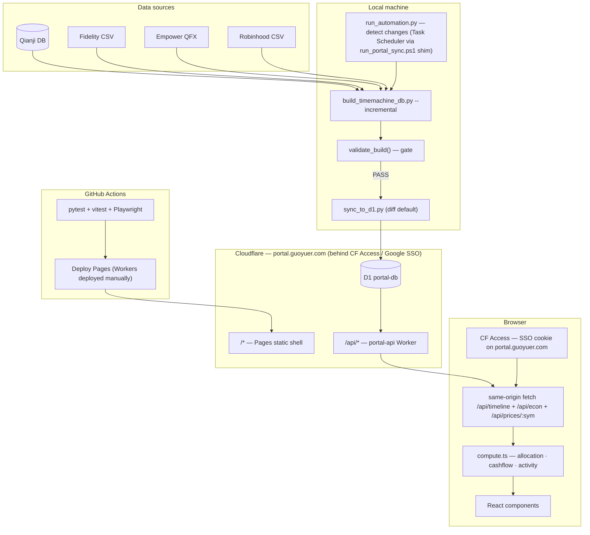

# Portal Architecture

Personal finance dashboard: Next.js 16 static shell + Cloudflare Worker/D1.

## System overview



**Principles:** D1 is persistent store, local DB is disposable cache. Diff sync pushes only new rows. Workers are thin adapters (shape work in D1 views, Zod validation at boundary). Frontend computes everything locally after one fetch.

**Routing (2026-04-13 migration):** The Worker mounts as a **zone route on `portal.guoyuer.com`** — same origin as Pages. `portal.guoyuer.com/api/*` → portal-api. One CF Access app on `portal.guoyuer.com` authenticates the page load and every subsequent API call with the same session cookie — no CORS preflight, no cross-subdomain cookie handshake.

---

## D1 schema

13 base tables are generated from `etl/db.py` via `gen_schema_sql.py`; the sync tooling appends `sync_meta` + `sync_log`, so D1 ends up with 15 tables.

| Table | Purpose | Sync strategy |
|-------|---------|---------------|
| `computed_daily` | Daily totals + 4 categories + liabilities | INSERT OR IGNORE |
| `computed_daily_tickers` | Per-day per-ticker value, cost basis | INSERT OR IGNORE |
| `computed_market_indices` | Index returns + sparklines | Full replace |
| `computed_holdings_detail` | Per-ticker performance | Full replace |
| `fidelity_transactions` | Classified records (runDate ISO, actionType, symbol, amount, lot_type account bucket) | Range replace |
| `robinhood_transactions` | Classified records (txnDate ISO, actionKind, ticker, quantity, amountUsd) | Range replace |
| `qianji_transactions` | Records (date, type, category, amount, isRetirement) | Range replace |
| `empower_snapshots` | 401k QFX snapshots (per-date totals) | Full replace |
| `empower_funds` | 401k fund metadata (cusip → ticker) | Full replace |
| `empower_contributions` | 401k contributions from paystub side-data | Full replace |
| `daily_close` | Per-symbol daily close prices (cache for ticker charts) | Diff replace |
| `categories` | Allocation metadata (key, name, displayOrder, targetPct) from `config.json` | Full replace |
| `econ_series` | Monthly time-series — FRED macro keys + `dxy` (Yahoo) + `usdCny` (Yahoo) | Full replace |
| `sync_meta` | last_sync timestamp, last_date coverage | Full replace (appended by sync tool) |
| `sync_log` | Append-only audit trail of D1 schema changes + sync runs | Not synced (D1-only, appended by sync tool) |

D1 has 12 camelCase views: `v_daily`, `v_daily_tickers`, `v_fidelity_txns`, `v_robinhood_txns`, `v_empower_contributions`, `v_qianji_txns`, `v_categories`, `v_market_indices`, `v_holdings_detail`, `v_econ_series`, `v_econ_series_grouped`, `v_econ_snapshot`.

Worker endpoints. portal-api strips `/api/` internally (so handlers match on `/timeline`, `/econ`, `/prices/:sym`):

- `GET /api/timeline` — parallel SELECTs across critical + optional views, ~4.6 MB / ~385 KB gzip
- `GET /api/econ` — econ_series snapshot + grouped series (includes `dxy`, `usdCny` alongside FRED keys)
- `GET /api/prices/:symbol` — daily close + transactions, on-demand per ticker click

Worker is a thin adapter: `SELECT` → JSON. There is NO runtime Zod validation on the Worker side — the frontend's `use-bundle.ts` Zod `safeParse` is the single drift checkpoint (doubling it on the shared schema cost ~200ms of Worker CPU per `/timeline` call with no added safety). All shape work lives in D1 views; the only TypeScript transform in the Worker is `JSON.parse(sparkline)` for market-index series.

`/api/timeline` is fail-open: the critical `v_daily` query returns 503 on failure, but optional sections (market, holdings, txns) degrade to `null` + an `errors: { market?, holdings?, txns? }` entry. Frontend panels render explicit error cards — missing data never hides silently.

---

## How net worth is computed

`computed_daily.total` = sum of all positive-value tickers. Four sources feed it — three live under `etl/sources/` as `InvestmentSource` Protocol implementations, Qianji stays outside the Protocol because its semantics are categorical flows rather than positions.

| Source | Module | Method |
|--------|--------|--------|
| Fidelity (brokerage) | `etl/sources/fidelity/` | Forward replay via `replay_transactions` → `(account, symbol) → qty` × `daily_close`; Fidelity cash reconstructed inside the same module and mapped to a money-market symbol |
| Robinhood | `etl/sources/robinhood.py` | Forward replay via the same primitive (shared `ReplayConfig`) → `symbol → qty` × `daily_close` |
| Empower 401k | `etl/sources/empower.py` | QFX snapshots + proxy interpolation between snapshot dates + contribution fallback from paystub data |
| Qianji | `etl/qianji.py` | Reverse replay from current balances, CNY at historical rate (not an `InvestmentSource` — provides liabilities + cash-side flows) |

`netWorth = total + liabilities` (credit cards from Qianji, negative).

---

## Frontend data flow

All computation is client-side after a single fetch. Zero network during brush interaction:

1. `GET /api/timeline` → parse with Zod `TimelineDataSchema` in `use-bundle.ts` (the single drift checkpoint).
2. Build indexes: `dateIndex` (date → array position), `tickerIndex` (date → tickers).
3. Brush drag → slice `daily[brushStart..brushEnd]` for chart zoom.
4. Point-in-time: `daily[brushEnd]` → allocation, snapshot.
5. Time-range: iterate `fidelityTxns` / `qianjiTxns` / `robinhoodTxns` / `empowerContributions` → cashflow, activity, grouped activity, cross-check.

All in `compute.ts` — pure functions, no network, <1ms for 3 years of data. Notable outputs:

- `computeMonthlyFlows` now emits a `savings` field (`max(0, income − expenses)`) and filters out zero-income months upstream — the chart consumes pre-prepared rows.
- `computeGroupedActivity` folds buys/sells/dividends for members of an `EQUIVALENT_GROUPS` entry (S&P 500, NASDAQ 100) into a single display row.
- `group-aggregation.ts::groupNetByDate` clusters Fidelity REAL transactions within a T+2 window, emits net exposure change per cluster (buy/sell + breakdown), and drops swaps below a $50 noise threshold.

Hover state for cluster markers lives in `src/lib/hooks/use-hover-state.ts` and is reused across the ticker and group dialogs.

## Equivalent-groups layer

Hand-maintained in `src/lib/config/equivalent-groups.ts` — `EQUIVALENT_GROUPS` maps a key (`sp500`, `nasdaq_100`) to `{ display, tickers: string[], representative: string }`. The `representative` ticker anchors the group chart's Y-axis: when you open "S&P 500", the chart plots VOO's daily close from `GET /prices/VOO`, overlaid with net buy/sell markers aggregated across all members (VOO + IVV + SPY + FXAIX + 401k sp500). This exposes rebalance timing even when members are swapped (selling VOO and buying FXAIX doesn't show as net exposure change).

Invariants enforced at module load:
- A ticker appears in at most one group.
- A group's `representative` is a member of its own `tickers`.

---

## Pipeline commands

```bash
# Full rebuild (build always scans everything; incremental is decided inside the orchestrator via refresh.py)
python scripts/build_timemachine_db.py

# Build flags (see `--help`): --csv <path>, --no-validate, --data-dir, --config,
# --downloads, --prices-from-csv, --dry-run-market, --as-of <YYYY-MM-DD>

# Sync to D1 (diff — default; range-replace with auto-derived --since)
python scripts/sync_to_d1.py

# Sync to D1 (explicit cutoff)
python scripts/sync_to_d1.py --since 2026-04-01

# Sync to D1 (DESTRUCTIVE full-replace — requires explicit flag)
python scripts/sync_to_d1.py --full

# Sync to local D1 (implies --full — prevents dev drift from prod)
python scripts/sync_to_d1.py --local

# Automated pipeline (detect changes → build → verify → sync)
# Orchestration lives in run_automation.py. Task Scheduler invokes the PS1 shim,
# which just forwards args to this script.
python scripts/run_automation.py                # default (live D1)
python scripts/run_automation.py --dry-run      # build + verify, skip sync
python scripts/run_automation.py --force --local  # bypass change detection, push to local D1
```

---

## Validation gate

`validate_build()` runs after build, blocks sync on FATAL:

| Check | Severity | Threshold |
|-------|----------|-----------|
| total ≈ SUM(tickers) per date | FATAL | >$1 diff |
| Day-over-day change | FATAL / WARNING | >20% AND >$10K / >15% AND >$5K (anchored to the latest `computed_daily` date; anomalies older than 7 days are suppressed — old 401k-snapshot step-functions aren't actionable) |
| Holdings > $100 have recent price | FATAL | Missing from daily_close |
| CNY rate freshness | WARNING | >7 days stale |
| Date gaps | WARNING | >7 calendar days |

---

## Replay verification

Run via `pipeline/scripts/verify_positions.py` (positions gate inside `run_automation.py` — exit code 4 on fail):

| Check | Contract |
|-------|----------|
| Fidelity positions | Each (account, symbol) share count from forward replay must match the latest `Portfolio_Positions_*.csv` exactly (no fuzz) |
| Fidelity cash | Each account's replayed cash balance must match the CSV's money-market row |
| 401k at QFX snapshot boundaries | Replayed value at every QFX `DTPOSTED` must equal the QFX snapshot (zero error) |
| Allocation vs live site | <1.5pp per category (manual spot check) |

---

## Tech stack

| Layer | Technology |
|-------|-----------|
| Frontend | Next.js 16 (static export), React 19, Recharts, Tailwind v4 |
| Backend | Cloudflare Worker + D1 (edge SQLite) |
| Pipeline | Python 3.14, SQLite, yfinance, fredapi |
| CI | GitHub Actions: pytest + vitest + Playwright (mock API) |
| Deploy | Cloudflare Pages (CI, on push to main) + Workers (manual `wrangler deploy` — CI's `CLOUDFLARE_API_TOKEN` lacks `Zone → Workers Routes → Edit`) |
| Auth | Cloudflare Access (Google SSO, allow-list = `guoyuer1@gmail.com`) on `portal.guoyuer.com/*` — gates page load and every `/api/*` call with the same session cookie |

Enabled: React Compiler (auto-memo), View Transitions, content-visibility auto.

---

## Remaining ideas (not planned)

- Speculation Rules API (prerender /econ from /finance)
- D1 Global Read Replication (only useful if traveling)
- ECharts/Nivo (only if Recharts hits perf limits at >5K points)
- Container Queries for metric cards (grid layout already sufficient)
