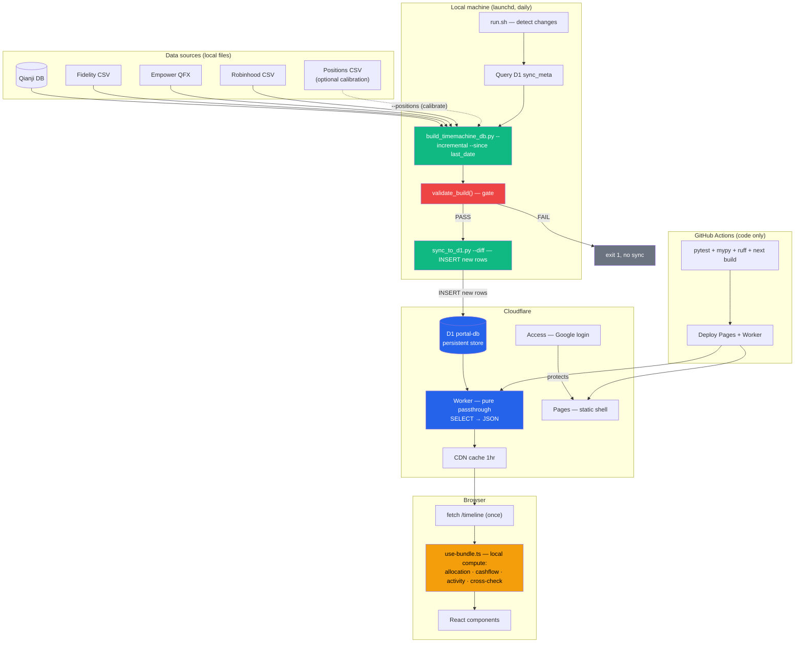

# Pipeline Cleanup TODO

Notes from April 9, 2026 session. Covers the full D1 pipeline: data correctness, simplification, automation, and frontend improvements.

## Target architecture



**Design principles:**
- **D1 is the persistent store** — local DB is a disposable build cache
- **Diff sync** — only new rows are pushed, idempotent
- **Build gate** — validation blocks sync on failure, bad data never reaches D1
- **Worker is pure passthrough** — SELECT → JSON, zero business logic
- **Frontend computes locally** — one fetch, then allocation/cashflow/activity are instant
- **Positions CSV is optional** — periodic calibration for cost basis, not required daily
- **Single classification** — pipeline classifies actions once, frontend uses classified types

---

## Background

### How net worth is computed
`computed_daily.total` = sum of all positive-value tickers on a given date, from five sources in `allocation.py`:

| Source | Value derivation |
|--------|-----------------|
| Fidelity positions | Forward replay → `(account, symbol) → qty` × `daily_close` price |
| Fidelity cash | Forward replay → per-account balance, mapped to FZFXX |
| Qianji accounts | Reverse replay from current balances, CNY at historical rate |
| Empower 401k | QFX snapshots + proxy interpolation + Qianji contribution fallback |
| Robinhood | Forward replay → `symbol → qty` × `daily_close` price |

`netWorth = total + liabilities` (liabilities are negative — credit cards from Qianji).

### Qianji date semantics
`user_bill.time` is the **user-specified transaction date** (Unix seconds, UTC), not the bookkeeping timestamp. Users can back-date entries. Replay uses this date.

### Current D1 tables (before cleanup)

| Table | Purpose |
|-------|---------|
| `computed_daily` | Per-trading-day totals + 4 categories + liabilities |
| `computed_prefix` | Cumulative prefix sums — **redundant, remove in Phase 1** |
| `computed_daily_tickers` | Per-day per-ticker value, category, cost basis |
| `fidelity_transactions` | Raw Fidelity records (11 cols, frontend uses 4) |
| `qianji_transactions` | Raw Qianji records (6 cols, frontend uses 4) |
| `computed_market` | Indices + FRED indicators mixed — **split in Phase 1** |
| `computed_holdings_detail` | Per-ticker performance metrics |

---

## Phase 1 — Clean up schema and contracts

Foundation work. Changes the data contract between pipeline, D1, Worker, and frontend. Must be done first because everything else builds on it.

### 1a. Remove `computed_prefix` table
**Rationale:** Frontend already iterates raw transactions for per-category/per-symbol breakdowns (< 1ms for 5yr data). Prefix sums are redundant and have caused the sell-sign inconsistency.
**Changes:**
- Delete from `db.py`, `precompute.py`, `build_timemachine_db.py`, `sync_to_d1.py`, `schema.sql`
- Remove `PrefixPointSchema` from `schema.ts`, `prefix` from Worker response
- Rewrite `computeMonthlyFlows()` to aggregate `qianji_transactions` by month
- `timemachine.tsx` brush panel reads from cashflow/activity instead of `range`

### 1b. Split `computed_market` into two tables
**Problem:** Index rows (`^GSPC`) and scalar indicators (`__fedRate`) share one table with a `__` prefix hack. Worker has to split them at runtime.
**Fix:**
```sql
computed_market_indices (ticker, name, current, month_return, ytd_return, high_52w, low_52w, sparkline)
computed_market_indicators (key, value)   -- 'fedRate', 'vix', 'usdCny', ...
```

### 1c. Store `action_type` instead of raw action strings
**Problem:** Pipeline classifies actions (`fidelity_history.py` → buy/sell/dividend/...) but D1 stores raw Fidelity strings. Frontend re-classifies with `action.startsWith("YOU BOUGHT")` — two parallel systems, fragile.
**Fix:** D1 stores `action_type`. Frontend matches `=== "buy"`. Single classification point.

### 1d. Trim D1 tables to only columns frontend needs
**Problem:** `fidelity_transactions` syncs 11 columns, frontend uses 4 (runDate, action_type, symbol, amount). 7 wasted columns.
**Fix:** D1 schema and sync only include needed columns. Same for `qianji_transactions` (drop `account`, `note`).

### 1e. Worker becomes pure passthrough
**Problem:** Worker does market split, holdings top/bottom slice, sparkline JSON parse.
**Fix:** Worker becomes `SELECT → JSON` only. Market split handled by separate tables (1b). Holdings slice moves to frontend. Sparkline returned as raw JSON string, parsed on client.

### 1f. Unify schema source — auto-generate `schema.sql` from `db.py`
**Problem:** Two manually maintained schemas have already drifted (`NOT NULL`/`DEFAULT` mismatches).
**Fix:** Script generates `schema.sql` from `db.py`, stripping local-only tables. One source, zero drift.

### 1g. Worker error handling + CORS
- Wrap D1 queries in try-catch, return structured 502 on failure
- Return 503 if `daily` is empty (fresh/broken D1)
- Restrict CORS to `portal.guoyuer.com` + `localhost:3000`

### 1h. Bug fix: 401K category detection
`use-bundle.ts:91` uses `=== "401K"` (exact). Change to `.toLowerCase().includes("401")`.

**After Phase 1:**
- D1 has 6 tables (prefix removed, market split into 2)
- Worker is ~15 lines (pure passthrough)
- Frontend uses `action_type` (not raw strings)
- No unused columns synced

---

## Phase 2 — Remove R2 legacy path

Depends on Phase 1 (clean schema). Deletes the old R2 pipeline entirely.

**Delete:**
- `.github/workflows/report.yml` — daily R2 report generation
- `pipeline/scripts/sync.py` — R2 upload
- `pipeline/scripts/send_report.py` — latest.json generation
- `pipeline/generate_asset_snapshot/report.py` — R2 report builder
- `pipeline/generate_asset_snapshot/renderers/json_renderer.py` — camelCase serializer
- `NEXT_PUBLIC_R2_URL`, `REPORT_URL`, `ECON_URL` from config

**Migrate:** `/econ` page → move FRED time-series to D1 (new table or extend `computed_market_indicators`), serve through Worker.

**Also clean up:** Old R2-era types in `schema.ts` (`ReportDataSchema`, `ActivityDataSchema`, `CashFlowDataSchema`, etc.) that are no longer used by the D1 path.

---

## Phase 3 — Build gate (data correctness)

Must be in place before automation (Phase 4). Bad data should never reach D1.

### `validate_build()` — post-build checks that block sync

```
build --incremental → compute → validate_build() → PASS → sync
                                                  → FAIL → exit 1, no sync
```

| Check | Catches | Severity |
|-------|---------|----------|
| `total ≈ SUM(tickers.value)` per date (within $1) | Categorization gap, negative value leak | FATAL |
| Day-over-day total change < 10% (without large txn) | Replay bug, price corruption | FATAL |
| Every holding > $100 has a price within 5 days | yfinance failure, delisted ticker | FATAL |
| Latest CNY rate within 7 days | Yahoo Finance down, stale rate | WARNING |
| No unrecognized action types | New Fidelity format, corporate actions | WARNING |
| No gaps > 5 trading days | Build range misconfiguration | WARNING |

FATAL = exit 1, no sync. WARNING = log, continue.

### Input-level warnings (during build)
- **CNY rate:** `allocation.py:113` hardcodes fallback `7.25`. Log warning if latest rate > 7 days stale. Fail if no rate at all.
- **Unrecognized actions:** `timemachine.py:117` silently drops unknown actions. Log warning with raw action string.
- **Missing prices:** `allocation.py:160` silently skips. Log per-ticker warning.
- **yfinance failures:** `prices.py` no error handling. Validate returned data, retry on timeout.

---

## Phase 4 — Automate pipeline (diff sync + D1 as persistent store)

Depends on Phase 1 (clean schema) + Phase 3 (build gate in place).

### Diff-based sync

```
run.sh:
  1. Detect changes (Qianji DB mtime, new CSVs in Downloads)
  2. Query D1 sync_meta for last_date
  3. build_timemachine_db.py --incremental --since <last_date>
  4. validate_build()  → FAIL? exit
  5. sync_to_d1.py --diff
  6. Update sync_meta
```

### `sync_meta` table
```sql
CREATE TABLE sync_meta (key TEXT PRIMARY KEY, value TEXT NOT NULL);
-- last_date  = '2026-04-08'            (data coverage)
-- last_sync  = '2026-04-09T14:30:00Z'  (sync timestamp, shown in frontend)
```

### Per-table idempotency

| Table | PK | Sync | Idempotency |
|-------|-----|------|-------------|
| `computed_daily` | `date` | Diff | `INSERT OR IGNORE` |
| `computed_daily_tickers` | `(date, ticker)` | Diff | `INSERT OR IGNORE` |
| `fidelity_transactions` | _(natural key)_ | Range replace | `DELETE WHERE date > ?; INSERT` |
| `qianji_transactions` | _(none)_ | Range replace | `DELETE WHERE date > ?; INSERT` |
| `computed_market_indices` | `ticker` | Full replace | Small table, always overwrite |
| `computed_market_indicators` | `key` | Full replace | Small table, always overwrite |
| `computed_holdings_detail` | `ticker` | Full replace | Small table, always overwrite |

All wrapped in `BEGIN; ... COMMIT;`. Failure → rollback.

### Parameterize paths
Remove hardcoded `C:/Users/guoyu/...` from `build_timemachine_db.py`. Use `--data-dir` / env var. Auto-detect platform paths for Qianji DB.

---

## Phase 5 — Replay optimization + calibration

### Checkpoint caching
Cache replay state (positions + cash + cost_basis) in local DB. Incremental builds resume from checkpoint instead of replaying all transactions from scratch.

```sql
CREATE TABLE replay_checkpoint (
    date       TEXT PRIMARY KEY,
    positions  TEXT NOT NULL,  -- JSON
    cash       TEXT NOT NULL,  -- JSON
    cost_basis TEXT NOT NULL   -- JSON
);
```

### Positions CSV calibration (`--positions`)
Fidelity positions CSV has `Cost Basis Total` per holding (reflects actual specific-lot selection). Use it to calibrate replay state.

```bash
python scripts/build_timemachine_db.py --incremental --positions Portfolio_Positions.csv
```

`--positions` does:
1. **Verify** — compare replay vs CSV (qty, cash, cost basis)
2. **Calibrate** — overwrite replay values with CSV ground truth
3. **Report drift** — log per-ticker cost basis delta since last calibration
4. **Checkpoint** — save calibrated state; subsequent builds start from here

```sql
CREATE TABLE calibration_log (
    date TEXT PRIMARY KEY, days_since_last INTEGER,
    total_cb_drift REAL, total_cb_pct REAL,
    positions_ok INTEGER, positions_total INTEGER,
    details TEXT  -- JSON per-ticker breakdown
);
```

---

## Phase 6 — Frontend UX + features

### UX fixes
1. **Show fetch errors** — `finance/page.tsx` never checks `tl.error`. Add error state.
2. **Empty range messages** — "No transactions in this period" instead of blank tables
3. **Data freshness** — show "Data as of: Apr 9" from `sync_meta.last_sync`. Yellow if > 3 days stale.
4. **Econ fetch timeout** — add `AbortSignal.timeout(10000)`
5. **Currency formatting** — consistent decimals ($9.99 and $10.50, not $9.99 and $11)

### New features (existing D1 data, no pipeline changes)
6. **Net worth milestones** — mark $100K/$250K/$500K/$1M crossings on chart
7. **Savings rate trend** — monthly savings rate line chart over full history
8. **Expense sparklines** — mini 6-month trend per category row in cashflow table

---

## Implementation order

```
Phase 1 (schema + contracts):  ~3-4 hours
  1a remove prefix, 1b split market, 1c action_type, 1d trim columns,
  1e Worker passthrough, 1f schema unify, 1g error/CORS, 1h 401K fix

Phase 2 (remove R2):           ~2-3 hours
  Delete legacy code, migrate /econ to D1

Phase 3 (build gate):          ~2 hours
  validate_build() + input warnings

Phase 4 (automate pipeline):   ~2-3 hours
  Diff sync, sync_meta, idempotency, parameterize paths, run.sh

Phase 5 (replay optimization): ~3 hours
  Checkpoint caching + positions calibration + drift tracking

Phase 6 (frontend):            ~4-5 hours
  UX fixes (1-5) + features (6-8)
```

Dependencies: `Phase 1 → Phase 2 → Phase 3 → Phase 4 → Phase 5`. Phase 6 can start after Phase 1.
