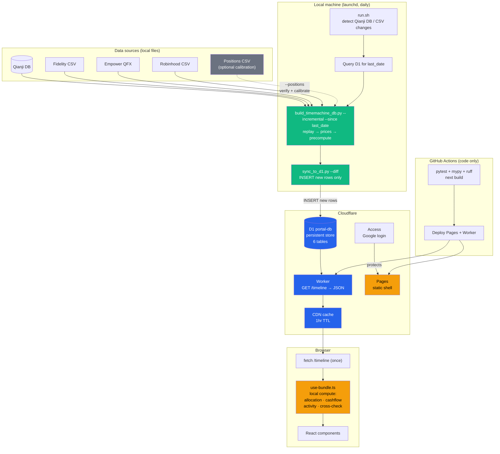

# Pipeline Cleanup TODO

Notes from April 9, 2026 session. Covers data pipeline simplification, bug fixes, and automation.

## Target architecture (after P0–P6)



**Key design principles:**
- **D1 is the persistent store** — local DB is a disposable build cache
- **Diff sync** — only new rows are pushed, not full table replacement
- **No R2** — all data flows through D1 → Worker → frontend
- **Frontend computes locally** — one fetch, then allocation/cashflow/activity are instant (no server round-trips during brush drag)
- **Positions CSV is optional** — used for periodic calibration (cost basis correction), not required for daily operation
- **CI is code-only** — data pipeline runs locally, CI only tests and deploys

---

## Background

### Qianji date semantics
`user_bill.time` is the **user-specified transaction date** (Unix seconds, UTC), not the bookkeeping/creation timestamp. Users can back-date or forward-date entries in the Qianji app. The replay cutoff compares against this field, so balances reflect when transactions *occurred* per the user, not when they were recorded.

### How net worth / portfolio total is computed
`computed_daily.total` is the sum of all positive-value tickers on a given date, assembled from four sources in `allocation.py`:

| Source | How value is derived |
|--------|---------------------|
| Fidelity positions | Forward replay of transaction CSV → `(account, symbol) → qty` × `daily_close` price |
| Fidelity cash | Forward replay → per-account cash balance, mapped to FZFXX |
| Qianji accounts | Reverse replay from current `user_asset` balances, CNY converted at historical rate |
| Empower 401k | QFX quarterly snapshots + proxy daily interpolation + Qianji contribution fallback |
| Robinhood | Forward replay of Robinhood CSV → `symbol → qty` × `daily_close` price |

`netWorth = total + liabilities` (liabilities are negative, i.e., credit cards from Qianji).

### D1 synced tables (7 tables)

| Table | Purpose | Used by |
|-------|---------|---------|
| `computed_daily` | Per-trading-day totals + 4 categories + liabilities | Chart, snapshot tiles |
| `computed_prefix` | Cumulative prefix sums (income, expenses, buys, ...) | Range tiles, monthly flow chart |
| `computed_daily_tickers` | Per-day per-ticker value, category, cost basis | Allocation table |
| `fidelity_transactions` | Raw Fidelity transaction records | Frontend: activity by symbol, cross-check |
| `qianji_transactions` | Raw Qianji cashflow records | Frontend: cashflow by category, cross-check |
| `computed_market` | Market indices (S&P, NASDAQ, CSI 300) + FRED indicators | Market context section |
| `computed_holdings_detail` | Per-ticker month return, 52w high/low | Holdings detail section |

---

## P0 — Bug fixes (R2 vs D1 logic differences)

### 1. 401K category detection is case-sensitive
**File:** `src/lib/use-bundle.ts:91`
**Problem:** `i.category === "401K"` is an exact match. R2 pipeline used `"401" in cat.lower()` (case-insensitive substring). If Qianji category is `"401k"` or `"401K Pre-tax"`, the D1 path will miss it, causing `takehomeSavingsRate` to be wrong (won't deduct 401K from take-home income).
**Fix:** `i.category.toLowerCase().includes("401")`

### 2. Sell amount sign inconsistency
**File:** `pipeline/generate_asset_snapshot/precompute.py:59` vs `src/lib/use-bundle.ts:201`
**Problem:** `precompute.py` uses raw amount for sells (`bucket["sells"] += amount`), frontend uses `Math.abs(t.amount)`. If Fidelity sell amounts are negative, prefix sums will show negative sells while frontend activity shows positive.
**Fix:** Use `abs(amount)` in `precompute.py` line 59, consistent with buys on line 57.

### 3. Reinvestment double-counting (intentional change, document it)
**D1 path** counts each reinvestment in both `buys_by_symbol` and `dividends_by_symbol` (use-bundle.ts:208-217, precompute.py:62-64). **R2 path** tracked `reinvestments_total` separately (report.py:191-192). The D1 approach is more accurate (reinvestment = dividend received + auto-buy), but makes buys/dividends totals larger than R2 reports. This is intentional — no fix needed, but good to be aware of when comparing.

---

## P1 — Remove `computed_prefix` table

**Rationale:** The frontend already iterates raw `qianji_transactions` and `fidelity_transactions` to compute per-category cashflow and per-symbol activity. For ~4,000 transactions (5 years), this takes < 1ms. The prefix table provides O(1) range totals, but those exact numbers are already computed as byproducts of the category/symbol aggregation. The prefix table adds pipeline complexity and has caused the sell-sign inconsistency (P0 #2).

**Current consumers:**
- `timemachine.tsx:171-177` — shows Income/Expenses/Buys/Dividends in brush panel → replace with `cashflow.totalIncome`, `cashflow.totalExpenses`, `activity.buysBySymbol` sum, `activity.dividendsBySymbol` sum
- `finance/page.tsx:90` — `computeMonthlyFlows()` uses prefix array for monthly bar chart → rewrite to aggregate `qianji_transactions` by month
- `finance/page.tsx:83` — `tl.range?.buys` for "invested" metric → replace with sum of `activity.buysBySymbol`

**Changes:**
- Delete `computed_prefix` from `db.py`, `precompute.py`, `build_timemachine_db.py`
- Delete from `sync_to_d1.py` TABLES_TO_SYNC (7→6)
- Delete `v_prefix` view from `worker/schema.sql`
- Remove `prefix` field from Worker `/timeline` response
- Remove `PrefixPointSchema` from `schema.ts`
- Rewrite `computeMonthlyFlows()` in `finance/page.tsx`
- Update `timemachine.tsx` brush panel to read from cashflow/activity

---

## P2 — Remove R2 legacy path

**What to delete:**
- `.github/workflows/report.yml` — daily R2 report generation
- `pipeline/scripts/sync.py` — raw file upload to R2
- `pipeline/scripts/send_report.py` — latest.json generation
- `pipeline/generate_asset_snapshot/report.py` — R2 report builder
- `pipeline/generate_asset_snapshot/renderers/json_renderer.py` — camelCase serializer for R2
- `NEXT_PUBLIC_R2_URL` from `.env.local`, CI secrets, `config.ts`
- `REPORT_URL`, `ECON_URL` from `src/lib/config.ts`

**What to migrate first:**
- `/econ` page currently fetches `econ.json` from R2. Move FRED time-series data into D1 (new table or expand `computed_market`) and serve through the Worker.

---

## P3 — Automate D1 pipeline (remove manual steps)

**Current flow (manual):**
```
Mac launchd → sync.py → R2        (automated, but R2-only)
Local:  build_timemachine_db.py    (manual, hardcoded Windows paths)
Local:  sync_to_d1.py              (manual, full DELETE + INSERT every time)
```

**Problems with current sync:**
- `sync_to_d1.py` does full-table DELETE + INSERT for all 7 tables every time, even if only 1 day is new
- Local `timemachine.db` is required — switching computers means full rebuild from scratch
- D1 is treated as a dumb mirror, not as persistent storage

**Target flow (fully automated, D1 as source of truth):**
```
Mac launchd → run.sh:
  1. Detect changes (Qianji DB mtime, new CSVs in Downloads)
  2. Query D1 sync_meta for last_date + last_sync
  3. build_timemachine_db.py --incremental --since <last_date>
  4. sync_to_d1.py --diff (only INSERT new rows)
  5. Update sync_meta (last_date, last_sync timestamp)
  → D1 updated, Worker serves fresh data (1hr CDN cache)
```

**Key change: diff-based sync instead of full replace.**

**Sync metadata table in D1:**
```sql
CREATE TABLE IF NOT EXISTS sync_meta (
    key   TEXT PRIMARY KEY,
    value TEXT NOT NULL
);
-- Written by sync_to_d1.py after each sync:
--   last_date  = '2026-04-08'       (latest trading day in computed_daily)
--   last_sync  = '2026-04-09T14:30:00Z'  (when sync ran)
```

- `last_date` — determines where incremental build starts (`--since`)
- `last_sync` — exposed by Worker in `/timeline` response, frontend shows "Data updated: 2 hours ago"

Worker adds `sync_meta` to the response:
```typescript
const meta = await env.DB.prepare("SELECT key, value FROM sync_meta").all();
// → { syncMeta: { lastDate: "2026-04-08", lastSync: "2026-04-09T14:30:00Z" } }
```

Per-table sync strategy:

| Table | Sync mode | How |
|-------|-----------|-----|
| `computed_daily` | Diff | INSERT rows where `date > last_d1_date` |
| `computed_daily_tickers` | Diff | INSERT rows where `date > last_d1_date` |
| `fidelity_transactions` | Diff | INSERT rows with `run_date` after last synced date |
| `qianji_transactions` | Diff | INSERT rows with `date` after last synced date |
| `computed_market` | Full replace | Small table (~10 rows), always refresh |
| `computed_holdings_detail` | Full replace | Small table (~40 rows), always refresh |

**D1 becomes the persistent store, local DB becomes a disposable build cache.** Switching computers: query D1 for `last_date`, run incremental build from there, push diff. No need to carry `timemachine.db` around.

**Changes needed:**
- `sync_to_d1.py`: add `--diff` mode — query D1 for max date, only generate INSERT for rows after that date. Full-replace only for market + holdings_detail.
- `build_timemachine_db.py`: accept `--since <date>` to skip dates already in D1. Parameterize paths via `--data-dir` / env var, remove hardcoded `C:/Users/guoyu/...`
- New `pipeline/scripts/run.sh`: detect changes → query D1 → build → diff sync, single entry point
- New launchd plist / Windows Task Scheduler task to run `run.sh` daily
- CI (`ci.yml`) stays code-only: test → Pages + Worker deploy

---

## P4 — Replay checkpoint caching + positions verification

### Problem
Even in `--incremental` mode, every new date requires a full forward replay — traversing all historical transactions from the very first one up to that date. `allocation.py:122-127` caches positions between consecutive days without transactions, but each replay still reads the entire CSV from the start. This gets slower as transaction history grows.

Reverse replay (from a positions CSV snapshot) was considered but rejected: it requires a positions CSV as anchor, and cost basis tracking is not cleanly invertible (division-by-zero on full sells, precision loss on partial sells). Since we don't want to depend on a positions CSV for normal operation, forward replay remains the only way to reconstruct holdings from pure transaction history.

### Proposed: checkpoint caching
Cache the forward replay state (positions + cash + cost_basis) at periodic dates in the DB. Incremental builds resume from the latest checkpoint instead of replaying from scratch.

**New table in `timemachine.db`:**
```sql
CREATE TABLE replay_checkpoint (
    date       TEXT PRIMARY KEY,
    positions  TEXT NOT NULL,  -- JSON: {"(acct,sym)": qty, ...}
    cash       TEXT NOT NULL,  -- JSON: {"acct": balance, ...}
    cost_basis TEXT NOT NULL   -- JSON: {"(acct,sym)": basis, ...}
);
```

**Incremental replay flow:**
```
Without checkpoint:  txn[0] → txn[1] → ... → txn[2000] → today     (all from scratch)
With checkpoint:     [checkpoint @ txn 1990] → txn[1991..2000] → today  (10 txns only)
```

**Checkpoint strategy:**
- After a full build, save a checkpoint at the latest date
- Incremental build: load latest checkpoint, replay only transactions after that date
- Optionally save a new checkpoint after each incremental build

### Positions CSV calibration (--positions)
When a `Portfolio_Positions_*.csv` is available, use it to **calibrate** replay state — not just verify. Fidelity's positions CSV includes `Cost Basis Total` per holding (computed using the user's actual lot selection method, e.g. specific lot identification). The current replay uses average cost, which diverges from Fidelity's numbers when specific lots are sold.

`portfolio.py:29` already reads `Cost Basis Total` from this CSV (used by the R2 legacy path). Reuse that parsing for calibration.

```bash
# Normal build (no CSV needed, uses replay + average cost)
python scripts/build_timemachine_db.py --incremental

# Calibrate with positions export (optional, when available)
python scripts/build_timemachine_db.py --incremental --positions path/to/Portfolio_Positions.csv
```

**`--positions` does three things:**

1. **Verify** — compare replay output vs CSV, report discrepancies:
   - Per-symbol quantity: flag mismatches > 0.001 shares
   - Per-account cash: flag mismatches > $0.01
   - Cost basis: flag mismatches > $1.00
   - Summary: `N/N positions match, M/M cash match, K/K cost basis match`

2. **Calibrate** — overwrite replay values with CSV truth:
   - Positions (qty per symbol per account)
   - Cash balances per account
   - Cost basis per position (from `Cost Basis Total` column — reflects actual lot selection)

3. **Report drift** — log the delta between replay and CSV at calibration time, so you can see how much error accumulated since last calibration:
   ```
   Calibration drift report (2026-04-09):
     VOO   qty: 0.000  cost_basis: replay=$41,230  actual=$40,875  drift=$355 (0.9%)
     QQQM  qty: 0.000  cost_basis: replay=$12,100  actual=$11,940  drift=$160 (1.3%)
     Cash:  replay=$5,230.15  actual=$5,230.15  drift=$0.00
     Total cost basis drift: $515 (0.7%)
     Last calibration: 2026-03-01 (39 days ago)
   ```
   Persist drift history in a table for trend tracking:
   ```sql
   CREATE TABLE calibration_log (
       date            TEXT PRIMARY KEY,
       days_since_last INTEGER,
       total_cb_drift  REAL,    -- total cost basis $ difference
       total_cb_pct    REAL,    -- total cost basis % difference
       positions_ok    INTEGER, -- count of qty matches
       positions_total INTEGER, -- total positions checked
       details         TEXT     -- JSON: per-ticker drift breakdown
   );
   ```

4. **Checkpoint** — save calibrated state as new checkpoint. All subsequent incremental builds start from this calibrated point, so cost basis drift doesn't accumulate.

This way:
- **Daily builds** use forward replay + average cost (good enough, no external input needed)
- **Periodic calibration** (whenever user exports positions CSV) snaps everything to Fidelity's ground truth
- **Drift report** shows how much error accumulated, helps decide calibration frequency
- Cost basis error resets to zero at each calibration, instead of growing forever

---

## P5 — Data quality hardening

### 1. CNY rate fallback is a hardcoded stale value
**File:** `allocation.py:113`
**Problem:** `last_cny_rate = 7.25` is used when Yahoo Finance has no data. If yfinance is down during a build, all CNY assets get valued at this stale rate with no warning.
**Fix:** Track rate staleness. If latest CNY rate in DB is > 7 days old, log a warning. If no rate at all, fail the build loudly instead of silently using 7.25.

### 2. Unrecognized Fidelity actions are silently dropped
**File:** `timemachine.py:117`
**Problem:** Only actions matching `POSITION_PREFIXES` affect share counts. Corporate actions (mergers, spinoffs, stock splits) and any new Fidelity action types are silently ignored — no log, no error.
**Fix:** Log a warning for every action that doesn't match any known prefix. Add a contract test that loads the actual CSV and verifies every action type is categorized.

### 3. Missing prices are silently skipped
**File:** `allocation.py:158-161`
**Problem:** If a ticker has no price data (delisted, yfinance failure, typo), `pd.notna(price)` silently skips it. The holding disappears from the portfolio total with no trace.
**Fix:** After computing `ticker_values`, check all holdings from replay have a value. Log a warning for any holding with qty > 0 but no price: `"VOO: 50 shares but no price on 2026-04-09"`.

### 4. yfinance failures are not handled
**File:** `prices.py`
**Problem:** If yfinance download times out or returns empty data for a symbol, no error is raised. The build succeeds with incomplete price data.
**Fix:** After each yfinance call, validate that expected symbols have data. Retry once on network timeout. Log which symbols returned zero rows.

### 5. Contract test coverage gaps
**File:** `tests/contract/test_invariants.py`
**Missing tests:**
- Every ticker in `computed_daily_tickers` has at least one price in `daily_close`
- Latest CNY rate is within 7 days of latest `computed_daily` date
- Every distinct `action` in `fidelity_transactions` maps to a known `action_type`
- `computed_daily.total` ≈ sum of `computed_daily_tickers.value` for same date (within $1)
- No date in `computed_daily` has total = 0 (unless it's the first date)

---

## P6 — Frontend UX improvements

### 1. Fetch error is not displayed
**File:** `src/app/finance/page.tsx:95-100`
**Problem:** `tl.error` is never checked. If `/timeline` fetch fails (Worker down, D1 empty, network error), user sees "Loading..." forever.
**Fix:** Add error state before loading check:
```tsx
if (tl.error) return <div className="text-red-500 text-center py-20">Failed to load: {tl.error}</div>;
```

### 2. Worker returns empty data without error signal
**File:** `worker/src/index.ts`
**Problem:** If D1 is empty (fresh database, failed sync), Worker returns `{ daily: [], prefix: [], ... }` with status 200. Frontend renders empty tables silently.
**Fix:** If `daily.results.length === 0`, return 503 with `{ error: "No data available" }`. Frontend can then show a clear message.

### 3. Empty data ranges show blank tables
**Files:** `cash-flow.tsx`, `portfolio-activity.tsx`
**Problem:** Selecting a date range with no transactions shows table headers with zero rows. User can't tell if data is missing or there were genuinely no transactions.
**Fix:** Show "No income/expenses in this period" or "No trading activity in this period" when items are empty.

### 4. No data freshness indicator
**Problem:** No way for the user to know when data was last updated. If sync hasn't run in a week, the dashboard looks normal but shows stale data.
**Fix:** Add a "Data as of: Apr 9, 2026" line in the header, derived from the latest date in `daily[]`. If > 3 days old, show in yellow/orange.

### 5. econ page has no fetch timeout
**File:** `src/app/econ/page.tsx`
**Problem:** `fetch(ECON_URL)` has no timeout. If R2 (or future D1 endpoint) hangs, page shows "Loading economic data..." forever.
**Fix:** Add `AbortSignal.timeout(10000)` like the finance page does in `use-bundle.ts:327`.

### 6. Currency formatting inconsistency
**File:** `src/lib/format.ts`
**Problem:** `fmtCurrency` uses 2 decimals for values < $10 but 0 decimals for >= $10. So $9.99 → "$9.99" but $10.50 → "$11". Jarring at the boundary.
**Fix:** Use 0 decimals for all values >= $1, or use 2 decimals consistently up to $1,000.

---

## P7 — D1 pipeline architecture cleanup

### 1. Schema dual-source — unify db.py and schema.sql
**Files:** `pipeline/generate_asset_snapshot/db.py`, `worker/schema.sql`
**Problem:** Two manually maintained schema definitions that have already drifted. `db.py` has `NOT NULL` + `DEFAULT` on most columns, `schema.sql` does not. Any future column addition must be done in two places.
**Fix:** Single source of truth. Either:
- (a) Auto-generate `schema.sql` from `db.py` (add a script that reads `_TABLES` DDL, strips local-only tables like `daily_close`/`empower_*`, and writes `schema.sql` + views)
- (b) Or use `schema.sql` as source and have `db.py` import it
Option (a) is simpler since `db.py` already has the superset.

### 2. sync_to_d1.py has no transaction wrapping
**File:** `pipeline/scripts/sync_to_d1.py`
**Problem:** Each table is `DELETE` then `INSERT` row-by-row. If sync fails mid-way (network timeout, wrangler crash), a table may be empty in D1 — data loss. No atomicity guarantee.
**Fix:** Wrap the entire SQL output in `BEGIN; ... COMMIT;`. D1 supports transactions. If any statement fails, the whole batch rolls back and D1 keeps the old data intact.

### 3. Worker has no error handling
**File:** `worker/src/index.ts`
**Problem:** `Promise.all()` with 7 D1 queries — if any one fails, the entire request returns an unhandled 500 error with no useful message. No try-catch, no partial degradation.
**Fix:** Wrap in try-catch. Return structured error:
```typescript
try {
  const [daily, ...] = await Promise.all([...]);
  // ...
} catch (e) {
  return Response.json(
    { error: "D1 query failed", detail: e instanceof Error ? e.message : "unknown" },
    { status: 502, headers: CORS_HEADERS }
  );
}
```

---

## Implementation order

```
P0 (bug fixes):           #1 (5 min), #2 (5 min)
P1 (remove prefix):       ~1-2 hours (pipeline + frontend + worker)
P2 (remove R2):           ~2-3 hours (delete code + migrate /econ)
P3 (automate pipeline):   ~1-2 hours (parameterize + run.sh + launchd)
P4 (checkpoint + verify): ~2-3 hours (checkpoint table + resume logic + verify mode)
P5 (data quality):        ~2-3 hours (validation + warnings + contract tests)
P6 (frontend UX):         ~2-3 hours (error states + empty states + freshness)
P7 (D1 architecture):     ~1-2 hours (schema unify + txn wrap + worker error handling)
```
