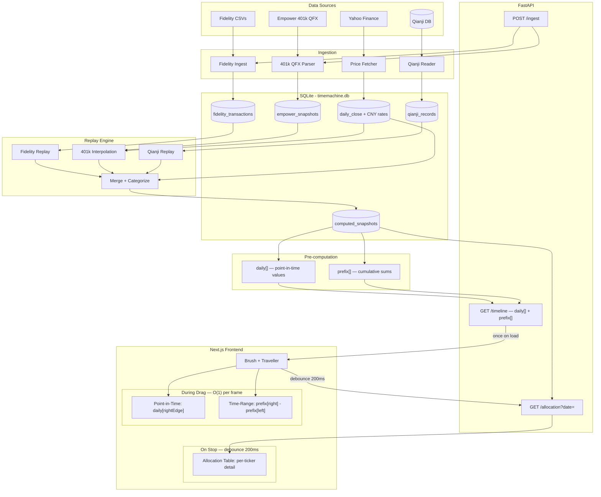

# Timemachine Design

Global allocation history: travel to any date, see the full portfolio picture.

## What it does

A time axis with a Recharts brush/traveller. User drags to navigate. Two data modes:

- **Point-in-time** (right edge of brush): allocation, positions, cash balances at that date
- **Time-range** (brush selection): cash flow, activity summary, transactions in that window

## Architecture



## Frontend performance model

Three interaction tiers, zero lag during drag:

| Tier | When | Data | Cost |
|------|------|------|------|
| **Initial load** | Page open | `GET /timeline` → daily[] + prefix[] (~50KB) | One request |
| **During drag** | Every frame | `daily[rightEdge]` for point-in-time, `prefix[right] - prefix[left]` for range | O(1), pure frontend |
| **On brush stop** | Debounce 200ms | `GET /allocation?date=` → per-ticker detail | One request |

### daily[] — point-in-time (drives chart + summary tiles)

One row per trading day (~800 rows for 3 years):

```typescript
{
  date: string        // "2025-06-15"
  total: number       // net worth
  usEquity: number    // category values
  nonUsEquity: number
  crypto: number
  safeNet: number
}
```

### prefix[] — cumulative sums (drives range tiles)

One row per trading day, cumulative values. Frontend computes any range in O(1):

```
rangeIncome = prefix[rightIdx].income - prefix[leftIdx - 1].income
```

```typescript
{
  date: string
  income: number       // Qianji
  expenses: number     // Qianji
  buys: number         // Fidelity
  sells: number        // Fidelity
  dividends: number    // Fidelity
  netCashIn: number    // deposits - withdrawals
  ccPayments: number   // Qianji repayments
}
```

### AllocationDetail — on brush stop

Full per-ticker breakdown, same structure as today's allocation table:

```typescript
{
  date: string
  categories: {
    name: string
    value: number
    pct: number
    target: number
    deviation: number
    holdings: { ticker: string; value: number; pct: number }[]
  }[]
}
```

## Data sources

| Source | What it provides | Historical method |
|--------|-----------------|-------------------|
| Fidelity transactions | Positions (shares per symbol per account) | Replay — verified 36/36 positions, 3/3 cash |
| Empower 401k QFX | 401k per-fund positions | Quarterly snapshots + proxy daily interpolation + contribution compensation |
| Yahoo Finance | Daily close prices + USD/CNY rate | Holding-period scoped, cached in SQLite |
| Qianji SQLite | Non-investment account balances | Reverse-replay from current balances. `user_bill.time` is the **user-specified transaction date** (not the bookkeeping timestamp); users can back-date entries in the app. |
| Config | Category/subtype/weight mapping | Static, same as today |

## How timemachine rebuilds allocation at any date

```
Fidelity replay(as_of) → positions + cash
401k interpolation(as_of) → per-fund values via proxy returns
Qianji replay(as_of) → account balances (native currency)
                ↓
    Merge + Categorize (config)
    positions × daily_close prices
    Qianji balances / historical CNY rate
    401k values by fund ticker
                ↓
    {ticker → value} → {category → value, pct, target, deviation}
```

### Fidelity replay (verified)

Module: `pipeline/generate_asset_snapshot/timemachine.py`

- Action prefixes: `YOU BOUGHT`, `YOU SOLD`, `REINVESTMENT`, `REDEMPTION PAYOUT`, `TRANSFERRED FROM`, `TRANSFERRED TO`, `DISTRIBUTION`, `EXCHANGED TO`
- `holdings[(account, symbol)] += quantity` — qty sign encodes direction
- Ignore Cash/Margin lot type, aggregate by (account, symbol)
- Cash: `sum(Amount where Type != "Shares") + sum(MM REINVESTMENT Quantity)`
- Accounts with replay: Z29133576 (Taxable), 238986483 (Roth), Z29276228 (Cash Mgmt)

### 401k (Empower QFX)

Module: `pipeline/generate_asset_snapshot/empower_401k.py`

- 12 quarterly QFX snapshots (2023-Q1 → 2025-Q4), exact per-fund mktval
- Between snapshots: `value(date) = snapshot_mktval × (proxy_today / proxy_at_snapshot)`
- Post-snapshot contributions: split 50/50 sp500/ex-us, scaled by proxy returns
- Fund → proxy: S&P 500 → VOO, Harbor Capital → QQQM, ex-US → VXUS
- Auto-corrects when new QFX is added

### Qianji replay (verified)

Reverse-replay from current `user_asset` balances:
- **Date semantics:** `user_bill.time` is the user-specified transaction date (Unix seconds, UTC), not the bookkeeping/creation timestamp. The replay cutoff compares against this date, so balances reflect when transactions *occurred* per the user, not when they were recorded.
- Expense: undo by adding back to `fromact`
- Income: undo by subtracting from `fromact`
- Transfer/Repayment: undo both sides (cross-currency via `extra.curr.tv`)
- Skip: accounts covered by Fidelity replay + "401k" (covered by QFX)
- CNY conversion: historical USD/CNY rate from Yahoo Finance

### Historical prices

- Holding-period scoped: only fetch prices for dates when symbol was held
- Cached in `prices.db` (SQLite), incremental updates
- Forward-fill for mutual funds (priced T-1) and weekends
- ~16K records for 66 symbols over 3 years

## Verification results

| Check | Result |
|-------|--------|
| Fidelity positions @ Apr-07-2026 | 36/36 exact match |
| Fidelity cash @ Apr-07-2026 | 3/3 exact match |
| Fidelity positions @ Aug-25-2025 | 22/22 exact match |
| Fidelity positions @ Apr-03-2026 | 34/36 (2 differ by post-snapshot reinvestment) |
| 401k at all 12 QFX quarter boundaries | 12/12 zero error |
| Allocation vs live site | Total: -1.2%, each category < 1.5pp |
| Safe Net % | 25.7% computed vs 26.5% live (0.8pp, from 401k sub-fund approximation) |

## Architecture evolution

### Legacy: static pipeline (R2, being phased out)
```
Python pipeline → latest.json → R2 → browser (daily batch, single snapshot)
```

### Current: backend + DB + Workers
```
Data sources → Ingestion → SQLite (timemachine.db) → Replay → Pre-compute
  → FastAPI (local dev) / D1 + Worker (production) → Next.js
```

### Implementation order
1. ~~Fidelity replay logic~~ ✅
2. ~~Historical prices + CNY rates~~ ✅
3. ~~Qianji balance replay~~ ✅
4. ~~401k QFX integration~~ ✅
5. ~~Cross-validation~~ ✅
6. ~~Unified SQLite DB (timemachine.db)~~ ✅
7. ~~Pre-compute daily[] + prefix[] arrays~~ ✅
8. ~~FastAPI endpoints~~ ✅
9. ~~Frontend brush/traveller integration~~ ✅
10. ~~Cloudflare D1 + Workers migration~~ ✅
